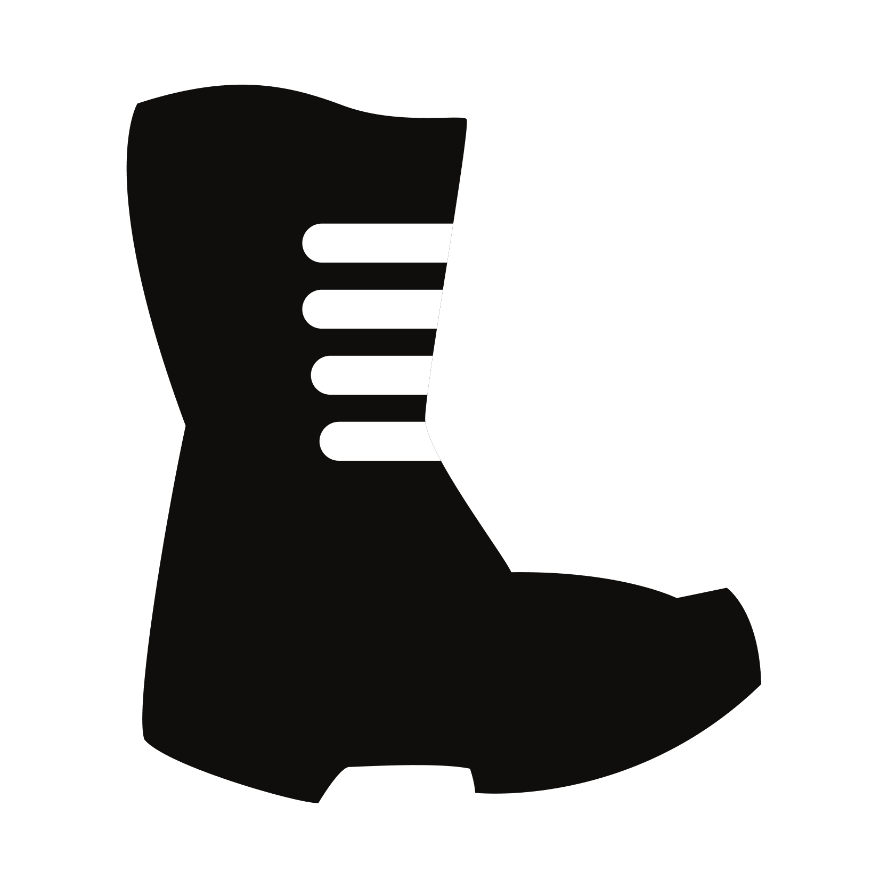
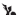
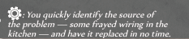
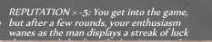
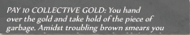
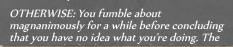
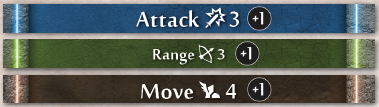
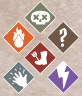
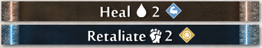
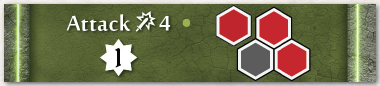

# Gloomhaven Rule Book
An inofficial light-weight, searchable copy of the rule book.

---
**
Pages 4 and 5
**

---

# Play Overview

The following section will teach you the mechanics for playing through an individual scenario, using the first one in the Scenario Book, **Black Barrow**, as an example.

**Standard Attack Modifier Deck**

[Standard attack modifier deck](img/rulebook/standard-attack-modifier-deck.png)

### THE PLAY AREA INCLUDES:

[Play area](img/rulebook/play-area.png)

- A modular board of map tiles (a), constructed in a specific configuration using the Scenario Book as a reference (see Scenario Setup on pp. 12–13 for details). The map tiles should be laid out with doors (b) connecting them. The configuration of overlay tiles and monsters for the first room (c) should also be set up along with the character figures.
- A character mat for each player (d) and the corresponding hand of ability cards for that character’s class (e), health and experience trackers (f), character tokens (g), a facedown battle goal card (h), and any equipped item cards (i).
- All monster statistic cards (j), with their corresponding standees, and monster ability cards (k) set to one side in individual shuffled decks.
- Shuffled decks of attack modifier cards for each player (l) and one for the monsters (m). **A standard attack modifier deck consists of twenty cards as shown at the top of the page**, not the characterspecific modifier cards found in the character boxes. A deck, however, may be modified by level-up bonuses, items, scenario effects, and the effects of the CURSE and BLESS conditions.
- Piles of damage tokens (n), money tokens (o), and condition tokens (p).
- The elemental infusion table (q) with all six elements set in the “Inert” column.

---
**
Page 6
**

---

## Character Mats

When a player begins their journey with the game, he or she will select one of the available character classes to play. Only one copy of each character class can be played in any given scenario. Each class has a unique set of abilities, so this is an important decision to make. When the box is first opened, the Brute , Tinkerer , Spellweaver , Scoundrel , Cragheart , and Mindthief  are available.

Once a character class has been chosen, the player takes the corresponding character mat, character tokens, and that character’s starting hand of Level 1 ability cards from the larger tuck box containing the character’s symbol, as well as the miniature contained in the smaller character tuck box.

### A CHARACTER MAT INCLUDES:

[Character mat and tracking dial](img/rulebook/character-mat.png)

- A portrait (a), icon (b), and name (c) of the class.
- Indicators of the maximum hit points at each level (d) of the class. Players should use tracking dials (e) to track their hit points (f) and experience (g) during a scenario.
- The maximum number of ability cards the class can take into battle (h).
- A short reference (i) for the round structure.
- Designations along the border (j) for where to place **discarded**, **lost**, and **active** cards.
- The reference number of the event cards (k) added to each deck when the character class is unlocked (not present on the six starting classes) and of event cards (l) added the first time the character class retires (see Announcing Retirement on p. 48 for details). These reference numbers apply to both city and road event decks.

---
**
Page 7
**

---

## Character Ability Cards

Playing ability cards is what allows a character to perform **actions** in a scenario. Each round players choose two ability cards and use the **top action** of one card and the **bottom action** of the other card, resulting in two **actions** for each player on his or her turn. All ability cards are specific to a character class and are acquired when starting a new character or by leveling up.

### AN ABILITY CARD INCLUDES:

[Ability card](img/rulebook/ability-card.png)

- The name of the ability (a).
- An initiative number (b). The initiative number of the leading card played determines a player’s order in the initiative of a given round (see Determining Initiative on p. 18 for more details).
- The level of the class card (c). A character starting at Level 1 can only use their Level 1 cards (or, alternately, Level X cards), but a character gains more powerful cards as they level up to add to their pool of available ability cards.
- A top action (d) and bottom action (e). When the two ability cards are played on a player’s turn, one is used for the top action and the other for the bottom action. Note that a single **action** can contain several separate **abilities** (f). (See Character Turn on pp. 18–28 for more details on character actions.)

---
**
Page 8
**

---

## Item Cards

Item cards are acquired by spending gold in between scenarios or looting specific treasure tiles. All item cards a character equips will be placed below his or her character mat and can be used during a battle to augment his or her abilities. Item cards are not class-specific, so any character can use any item. However, characters are limited in the number of items they can **equip** (bring into a scenario). Each character can equip only one  item, one  item, one  item, up to two  items **OR** one  item, and up to a number of  equal to half their level, rounded up. **Characters cannot own more than one copy of any item card.**

 |  |  |  |  | 
-----|------|------|----------|-----------|-----------
Head | Body | Legs | One Hand | Two Hands | Small Item

### AN ITEM CARD INCLUDES:

[Item card](img/rulebook/item-card.png)

- The name of the item (a) and the amount of gold a character must pay to acquire the item from the shop (b).
- What happens to the card after it is used (c). 
  - This symbol  means the item is **spent** after use, which is denoted by rotating the card to its side. Spent cards can be refreshed when a character performs a long rest (see Resting on p. 17 for more details). Sometimes an item is used multiple times before it is spent or consumed. This is depicted by use slots (d) on the card and can be tracked using a character token. 
  - This symbol  (not pictured) means the item is **consumed** after use, which is shown by flipping the card facedown. Consumed cards can only be refreshed **during a scenario** by specific abilities. **All items are refreshed between scenarios.** No item can be permanently consumed. 
  - If a card depicts neither of these symbols, there are no restrictions on the number of times it can be used during a scenario, other than what is written in the text of the card.
- When the item can be used and the bonus gained by the character when the item card is used (e).
- The equip slot (Head, Body, Legs, One Hand, Two Hands, Small Item) the item occupies (f).
- Some equipped items add a number of  cards to the equipping character’s attack modifier deck at the start of a scenario. If this is the case, the number of modifier cards is specified on the item (g).
- A count of how many of this item are in the game (h) and where this card lies within that count (i).
- Reference number for the item (j), which is on the back of the card.

---
**
Page 9
**

---

## Monster Statistics Cards

Monster statistic cards give easy access to the base statistics of a given monster type for both its normal and elite variants. A monster’s base statistics will vary depending on the **scenario level** (see Scenario Level on p. 15 for details). Each edge of the cards, on both sides, reflects the statistics for a given scenario level. Rotate or flip the card to show the required level.

A monster stat sleeve should be used to track damage and condition tokens and to hide the unneeded information for other unused levels.

### A MONSTER STATISTIC CARD INCLUDES:

[Monster Statistics Card](img/rulebook/monster-stat-card.png)

- The monster’s name (a) and level of the statistic set (b) corresponding to the scenario level.
- Sections for normal (c) and elite (d) versions of this monster.
- A monster’s **hit point** value (e), which is the amount of damage that needs to be inflicted on the monster before it dies.
- A monster’s **movement** value (f), the base number of hexes a monster can move with a **Move** action.
- A monster’s **attack** value (g), the base amount of damage the monster does with an **Attack** action.
- A monster’s **range** value (h), which is the base number of hexes away from the monster’s own hex that the monster can reach with an attack or a heal. A “–” as the range value signifies the monster’s normal **Attack** action can only target adjacent hexes (i.e., a **melee** attack).
- Any special traits this monster type possesses (i). These traits are permanent and persist from round to round. These traits may include Flying, which is symbolized by  (j) next to the monster’s name (see Move on p. 19 for details).

---
**
Page 10
**

---

## Monster Ability Cards

Each round, after players have selected their own ability cards, one card is played for each monster type currently on the board from their respective decks of monster ability cards. These cards determine which abilities each monster of that type—both normal and elite—will perform during the round on its turn.

### A MONSTER ABILITY CARD INCLUDES:

[Monster Ability Card](img/rulebook/monster-ability-card.png)

- The name of the monster type (a). Sometimes, multiple monster types use the same, more generic ability deck. For instance, Bandit Guards, City Guards, and Inox Guards all use the same “Guard” deck.
- An initiative number (b). This number will determine when every monster of that type will act in a given round (see Determining Initiative on p. 18 for details).
- A list of abilities (c). A monster will perform each of these abilities in the order listed (if possible) and then end its turn (see Monster Turn on pp. 29–32 for details).
- A shuffle symbol (d). If this symbol appears on a card, shuffle the corresponding monster’s ability discard pile back into the draw deck at the end of the round.

## Battle Goal Cards

[Battle Goal Card](img/rulebook/battle-goal-card.png)

**At the beginning of every scenario, each character receives two battle goal cards in secret and chooses one to keep, discarding the other.** If the scenario is successfully completed and the character meets the criteria of the chosen card (a), he or she will earn a number of **checkmarks** as specified on the bottom of the card (b). Checkmarks are used to enhance a player’s attack modifier deck (see Additional Perks on p. 44 for details). If the scenario resulted in failure, the character receives nothing from his or her battle goal card, regardless of whether the goal was achieved. Players can keep track of their battle goal progress using notes if necessary. Players should keep their battle goals secret from one another until the scenario is over.

---
**
Page 11
**

---

## Attack Modifier Cards

Any time an **Attack** ability is performed, a separate attack modifier card is drawn for **each individual target** of the attack. Players draw from the personal attack modifier deck for their chosen character and monsters draw from a collective monster deck. The modifier listed on the card is then applied to the attack, possibly reducing or increasing its numerical value.

### AN ATTACK MODIFIER CARD INCLUDES:

[Attack Modifier Cards](img/rulebook/attack-modifier-cards.png)

The value of the modifier for the attack (a). A “Null” symbol (b) means that no damage is done by the attack. A “2x” symbol (c) means the attack value is doubled.

Conditions, elemental infusions, or other special effects of the attack (d). If the attack modifier of the card is +0, the special effect is shown in the center circle of the card (e). Otherwise, it is shown to the left of the modifier value (f). When these special effects are activated, they function exactly as if they had been written on the action card being used for the attack.

[Rolling Modifier Card](img/rulebook/rolling-modifier-card.png)

A rolling modifier symbol (g) indicates that an additional modifier card should be drawn. Modifier cards are then drawn until a rolling modifier is **not** revealed, at which point all the drawn modifiers are added together.

[Rolling Modifier Example](img/rulebook/rolling-modifier-example.png)
*Add “PUSH 2” and the earth element effects to your attack, then increase y our attack value by 2.*

[BLESS and CURSE cards](img/rulebook/bless-curse-cards.png)

A special BLESS (h) or CURSE (i) border. If a BLESS or CURSE card is drawn, it should be **removed** from the player’s deck instead of being placed into the discard. Curse cards also have either a  or an  to denote whether they can be placed in the monster attack modifier deck , or a character's attack modifier deck .

[Shuffle symbol](img/rulebook/shuffle.png)

A shuffle symbol (j). At the end of the round in which a “Null”  or “2x”  card is drawn from a deck, players will shuffle all the played modifier cards back into that particular draw deck. This shuffling also happens if a modifier card must be drawn and there are none left in the draw pile.

[Modifier type icons](img/rulebook/modifier-type-icons.png)

A type icon (k). All standard attack modifier decks have a 1, 2, 3, 4, or M icon (l) for easy sorting, such that all cards with a given icon form the standard 20-card deck. All cards a character class adds to their modifier decks through perks (see Leveling Up on pp. 44–45 for details) have the symbol of that character class (m). Cards added to a modifier deck by a scenario or item effect have a  icon (n). These cards should be removed at the end of a scenario.

---
**
Page 12
**

---

# Scenario Setup

When setting up a new scenario, the first step is to look in the scenario book to set up the map tiles and prepare all the monster types you will be fighting. Then read the introduction text and apply any negative scenario effects from the “Special Rules” section. Next, two battle goals should be dealt to each player, one of which will be discarded. Players can then decide which items they would like to equip from the collection of items they own (adding in -1 cards to their attack modifier decks when applicable). Next, players should decide which ability cards they would like to put in their hand, choosing from the pool of those available to them. A player must select a number of cards equal to his or her character’s hand size. When first starting the game, a player’s hand should only consist of the set of **Level 1** ability cards for the character’s class. Once a player has become familiar with the class, he or she can begin substituting out Level 1 cards for the more complex cards with **X** as the level. Once the character begins to level up, he or she will also get access to higher level cards to add to his or her hand by pulling others out. After players select their hand, any effects of a preceding road event or city event are applied (see Traveling and Road Events on p. 41 for details).

## Scenario Page

[Scenario page](img/rulebook/scenario-page.png)
- The name (a), reference number (b), and grid location (c) of the scenario with completion check box.
- Any achievements (d) required to play the scenario in a campaign.
- The victory conditions (e).
- When playing the scenario as part of a campaign, the page provides introductory text (f), additional story points (g) that are read when entering the corresponding hex on the board (h), and concluding text (i) to be read when the victory condition is met.
- The name, reference number, and grid location of any new scenario locations (j) unlocked by completing the scenario within a campaign.
- Any other rewards (k) earned by completing the scenario when in a campaign.

---
**
Page 13
**

---

- Any locations the scenario links to ((l); see Traveling and Road Events on pp. 41–42 for details).
- The configuration of map tiles (m) and door tiles (n) to be placed during setup. The specific map tiles needed for each scenario are also given (o). Each scenario map is broken up into separate rooms by door overlay tiles. A room may contain more than one map tile if those tiles are connected by other overlay tiles.
- [Monster key](img/rulebook/monster-key.png)
 
  Indications used to populate the scenario map based on the monster key . These indications may be in one of two different orientations depending on the overall orientation of the map. Monster placement is indicated in a symbol’s upper left for two characters, upper right for three characters and bottom for four characters. **BLACK** means the monster is not present, **WHITE** means a normal monster is present, and **GOLD** means an elite monster is present. Normal monsters should be placed on the map with their corresponding standees in white bases, and elite monsters should be placed in gold bases. Example: / indicates which type of monster is placed on this hex, and in this case no monster is placed in for two characters, a normal monster is placed for three characters, and an elite monster is placed for four characters. 

  ***Example:**  indicates which type of monster is placed on this hex, and in this case no monster is placed in for two characters, a normal monster is placed for three characters, and an elite monster is placed for four characters.*

  **Note that only monsters in the starting room are placed at the beginning of a scenario. Monster standees each have a number to determine the order in which they act during the turn (see Order of Action on p. 29 for details). The standee numbers should be randomized when placed.**
  
- The available starting character locations, depicted by  (r) . Players can choose to place their figures on any empty  hex at the start of the scenario.
- The type of traps used in this scenario (s) and the reward for looting any treasure tiles on the board (t). The numbers for the treasures are referenced in the back of the Scenario Book, so that rewards are kept secret.
- Locations of money tokens (u) and overlay tiles (v) to be placed on the map when the room tile is revealed.

---
**
Page 14
**

---

## Overlay Tiles

A scenario is constructed from a set of map tiles as instructed in the Scenario Book. Additionally, there will be special overlay tiles to fill out the encounter.

### TYPES OF OVERLAY TILES:

- **Doors** . A door acts as a separation between two rooms. When a character moves onto a closed door tile, they immediately flip over the door tile to the open side, revealing the adjacent room tile. Immediately place overlay tiles, monsters, and money tokens as indicated in the scenario description for the revealed room. While closed doors do not hinder character movement at all, they act as a wall for any monsters or character-summoned figures, and figures cannot be forced through a closed door. Open doors do not hinder any movement and cannot be closed. Door art varies by environment type, but they all function exactly the same.
- **Corridors** . A corridor is placed on the connection of two map tiles to cover the walls and create a single room out of multiple map tiles. Corridors act like normal empty hexes.
- **Traps** . A trap is sprung when a figure enters its hex with normal or forced movement. Flying  and Jump  movements are unaffected by traps. When a trap is sprung, it inflicts some negative effect on the figure who sprung it and then it is **removed from the board**. A trap can also be disarmed through specific actions to remove it from the board without suffering its negative effects. Trap effects are varied and are specified in the Scenario Book. If part of a trap’s effect is listed as “damage,” the trap will inflict **2+L damage** on the affected figure, where L is the **scenario level**. Characters and monsters can also create traps on the board, with the effects specified by the ability that creates the trap. Whenever a trap is placed on the board, tokens for the damage and effects the trap applies should be placed on top of the trap tile for easy reference.
- **Hazardous terrain** . If a figure enters a hex with hazardous terrain via normal or forced movement, each hex will inflict half the damage of a trap (rounded down). Flying  and Jump  movements are unaffected by hazardous terrain. Unlike traps, hazardous terrain does not get removed after its effect is applied, but instead remains on the board indefinitely. Starting a turn on or exiting these hexes does not cause additional damage.
- **Difficult terrain** . It takes a figure two normal movement points to enter a hex with difficult terrain. Flying , Jump , and forced movements are unaffected by difficult terrain.
- **Obstacles** . Obstacles have varying artwork, but they all have the same function: figures cannot move through obstacles with a normal movement, but can move through them with a Flying  or Jump  movement. **Obstacles do not hinder ranged attacks.** It is possible for certain character abilities to create or move obstacles. When doing so, players can never completely cut off one area of the scenario map from another, such that the area cannot be moved into without going through the obstacles.

---
**
Page 15
**

---

- **Treasure** . Treasure tiles can be looted by a player (see Loot on p. 27 for details) for a variety of effects. There are two types of treasure tiles: “goal” tiles and numbered tiles. Goal tiles are important for the completion of a scenario, and the rules for looting them will be specified by the scenario. “Goal” tiles are reset every time a scenario is played. Numbered tiles can provide a number of different benefits. When one is looted, the looting player should immediately reference the number of the tile with the treasure index in the back of the scenario book to discover what was looted. If a **specific item name** is listed, find this item in the deck of unique items and immediately add it to your pool of items. If an **item design** is listed, find all copies of that item and add them to the city’s available supply. **Numbered treasure tiles can only be looted once.** After they have been looted, they should be crossed off in the Scenario Book as a reminder.

## Scenario Level

**Monster base statistics**, **trap damage**, the **amount of gold received from money tokens**, and the **amount of bonus experience for completing a scenario** are all dependent on the level of the scenario being played. The **scenario level** is chosen by the players before the scenario begins and is based on the average level of the party and how difficult the players want the scenario to be.

A scenario’s level can be set to any number from 0 to 7, but cannot be changed once the scenario begins. The **recommended** scenario level is equal to the average level of the characters in the party, divided by 2 and rounded up; this would be considered “Normal” difficulty. If players desire an “Easy” experience, they can reduce the recommended scenario level by 1. If a more difficult experience is desired, the scenario level can be raised by 1 for “Hard” or 2 for “Very Hard.”

Difficulty | Level modification
-----------|-------------------
Easy       | -1
Normal     | +0
Hard       | +1
Very Hard  | +2

Scenario level | Monster level | Gold conversion | Trap damage | Bonus experience
---------------|---------------|-----------------|-------------|-----------------
0|0|2|2|4
1|1|2|3|6
2|2|3|4|8
3|3|3|5|10
4|4|4|6|12
5|5|4|7|14
6|6|5|8|16
7|7|6|9|18

***Example**: If a party contains a Level 6 character, two Level 4 characters, and a Level 3 character, the average would be 4.25; divided by 2 and rounded up is 3, so a normal scenario difficulty level would be 3. The choice of scenario level is completely up to the players. Higher scenario levels will result in more difficult monsters, but will also yield more gold and experience.*

---
**
Page 16
**

---

## Game Variant: Open Information and Solo Play

A single player can play the game as a solo experience by controlling two or more characters at once. Part of the game’s difficulty, however, comes from not knowing exactly what the other characters will be doing on their turn. Because a solo player has precise information about what each character is doing and can coordinate more effectively, the game becomes easier. To compensate for this, solo players should **increase the monster level and trap damage by 1 for any given scenario without increasing gold conversion and bonus experience.**

Scenario level | Monster level | Gold conversion | Trap damage | Bonus experience
---------------|---------------|-----------------|-------------|-----------------
0|1|2|3|4
1|2|2|4|6
2|3|3|5|8
3|4|3|6|10
4|5|4|7|12
5|6|4|8|14
6|7|5|9|16

Additionally, if they wish, a group of players may also play with fully open information by increasing the difficulty in the same way as for solo play. Playing with open information means that players can share the exact contents of their hands and discuss specific details about what they plan on doing. **This is not the recommended way to play the game**, but it may be desirable for certain groups.

# Round Overview

A scenario consists of a series of **rounds** that are played until players either meet the victory conditions of the scenario or fail the scenario. A round consists of the following steps:

1. **Card selection:** Each player will either select two cards from his or her hand to play or declare he or she is performing a **long rest action** for the round.
2. **Determining initiative:** Players reveal their cards for the round, and an ability card for each monster type currently in play is also revealed. An initiative order is then determined based on the initiative values of these revealed cards.
3. **Character and monster turns:** Starting with the lowest initiative, players and monsters will act out their **turns**, performing the actions on their cards, possibly modified by character item cards.
4. **Cleanup:** Some cleanup may be required at the end of the round (see End of Round on p. 32 for details).

## Card Selection

At the beginning of a round, each player will secretly select two cards from his or her hand to play facedown in front of them. Of the two cards, one should be selected as the **leading card**, which will determine the player’s order in the initiative for the round (see Determining Initiative on p. 18 for details).

---
**
Page 17
**

---

Players should not show other players the cards in their hands nor give specific information about **any numerical value or title** on any of their cards. They are, however, allowed to make general statements about their actions for the round and discuss strategy. 
- **Examples of appropriate communication:** “I’m attacking this guard near the middle of the round.”; “I’m planning on moving here and healing you pretty early in the round, hopefully before the monsters attack.” 
- **Examples of inappropriate communication:** “You’ll need lower than an initiative 17 to go before me.”; “I should be doing 4 points of damage to the bandit, so you don’t have to worry about him.”; “I’m going to use Impaling Eruption and wipe out everyone.”

During a player’s turn, the two played cards will be used to perform actions and then are either **discarded**, **lost**, or **activated**, depending on the actions that were taken. Played cards are normally placed in a player’s **discard pile** unless otherwise noted. **Discarded** cards can be returned to a player’s **hand** through **resting** (see below). If the performed action from a card contains a  symbol in the lower right of the action field, the card is instead placed in a player’s **lost pile**. Lost cards can only be returned to a player’s hand during a scenario by using a special **recover** action. Whether the corresponding card is lost or discarded, some actions may contain an **active** effect (denoted by the symbols at right). Instead of being placed in the discard or lost pile, the card is placed in the **active area** in front of the player to keep track of the effect. Once the effect wears off, the card is then transferred to the appropriate pile (see Active Bonuses on pp. 25–26 for details).

 |  |  | 
-----|------|------|----------
Lost | Recover | Persistent Bonus (Active Effect) | Round Bonus (Active Effect)

Players **must** either play two cards from their hand or declare a **long rest action** at the beginning of **every** round. If a player only has one card or no cards in their hand, the long rest action is their only option. If this option is **also** not available at the beginning of a round because a player has only one card or no cards in their discard pile as well, that player is considered **exhausted** and can no longer participate in the scenario (see Exhaustion on p. 28 for details).

### RESTING

Resting is the main way players can return discarded cards back into their hand of available cards. A player has two options when resting: a **short rest** or a **long rest**. In both cases, the rest action can -**only** be taken if a player has two or more cards in his or her discard pile, and a rest action **always** results in losing one of the discarded cards.

- **Short rest:** During the cleanup step of a round, a player can perform a short rest. This allows that player to immediately shuffle his or her discard pile and **randomly** place one of the cards in the lost pile, then return the rest of the discarded cards to his or her hand. If the player would like to instead **keep** the card that was randomly lost, he or she can choose to suffer 1 damage and **randomly** lose a **different** discarded card, but this can only be done once per rest.
- **Long rest:** A long rest is declared during the card selection step of a round and constitutes the player’s entire turn for the round. Resting players are considered to have an initiative value of 99. On the player’s turn, at the end of the initiative order, he or she must **choose** to lose one of his or her discarded cards, then return the rest of the discarded cards to his or her hand. The resting character also **performs a “Heal  2, Self” action and refreshes all of his or her spent item cards.**

---
**
Page 18
**

---

## Determining Initiative

After players have either selected their two action cards or declared a long rest, the players reveal a monster ability card for each type of monster that has at least one figure currently on the map. In addition, each player not taking a long rest reveals his or her selected cards for the round, placing their **leading card** on top so that its initiative value is visible.

Initiative order is determined by comparing the initiative values on all played monster ability cards and all of the players’ leading cards. Whoever has the lowest initiative value takes their turn first, then the next highest, and so on until every figure on the board has acted. When a monster type takes an action, each monster of that type will perform the actions listed on their played ability card, starting with elites and then normal monsters in ascending standee order.

If there is ever a tie in initiative between players, consult the non-leading card of each player to break the tie. (If there is still a tie, players should decide among themselves who goes first.) If there is a tie between a player and a monster type, the player goes first. If there is a tie between two monster types, the players decide which goes first.

[Initiative example](img/rulebook/initiative-example.png)

***Example:** At the start of the round, the Brute decides that he wishes to play the two cards shown. He also decides he wants to go late in the round, so he choses the “61” as his leading card. If he had wanted to go early, he could have chosen the “15” as the leading card. The Scoundrel reveals a leading card with “86” initiative, and the played Living Bones and Bandit Archer monster ability cards have “45” and “32” initiative respectively. The Bandit Archers activate first, then all of the Living Bones, then the Brute, and finally the Scoundrel.*

## Character Turn

On a character’s turn, he or she will perform the **top** action of one of the two ability cards played and the **bottom** action of the other. The **leading card** designation used to determine initiative is **no longer significant**. Either card can be played first for its top or bottom action. When playing a card’s action, the abilities of the action must be done in the order written and can’t be interrupted by the action on the other card. As soon as the action of a card is completed, it is immediately placed in the appropriate area (discard pile, lost pile, or active area) before anything else happens. Players are typically free to choose not to perform any part of the action on their card, however, they **must** perform any part that will cause a negative effect (e.g., reduce hit points, lose cards, or cause a negative condition) on themselves or their allies. An **ally** is any figure that fights with a character. This term includes summoned figures, but does not include the character itself. Abilities cannot affect allies unless the card or rules specify otherwise.

[Basic actions](img/rulebook/basic-action.png)

Players can also use **any card they play** as an **“Attack 2”** action on the **top** half or a **“Move 2”** action on the **bottom**. If a card is used this way, it is always discarded, regardless of what is printed on the card. On their turn, before, during, or after performing their two actions, players can use any number of items they have equipped.

---
**
Page 19
**

---

### MOVE

 A **“Move X”** ability allows a character to move **up to** X number of hexes on the map. Figures (characters and monsters) can move through allies, but cannot move through enemies or obstacles. Traps and other terrain effects of hexes must be resolved when a figure enters them with normal movement. A figure cannot end its movement in the same hex as another figure. Figures can **never** move through walls.

 Some Move abilities are specified as a “Jump.” **Move X (Jump)** allows the character to ignore all figures and terrain effects during their movement. However, the last hex of a jump is still considered a normal movement, and so must obey the normal movement rules above.

 Some figures may also have the **“Flying”** special trait. This allows figures to completely ignore any figures and terrain tiles during any part of their movement, including the last hex, except that they still must end their movement in an **unoccupied** hex (no figures present). This includes forced movement like PUSH or PULL. If a figure loses its Flying trait while occupying an obstacle hex, it takes damage as if it had sprung a damage trap and then moves immediately to the nearest **empty** hex (no figures, tokens, or overlay tiles of any kind present except corridors, pressure plates, and open doors).

#### REVEALING A ROOM

During any part of a character’s movement, if they enter a tile with a closed door, flip the door tile to the opened side and immediately reveal the adjacent room on the other side of the door. The Scenario Book will then specify what monsters, money tokens, and special overlay tiles should be placed in the revealed room, based on the number of characters (including exhausted characters). Note that, as in scenario setup, the standee numbers of the monsters in the new room should be randomized when placed. It is possible to run out of specific types of monster standees when revealing a room. If this happens, place only the standees that are available, starting with the monsters closest to the revealing character.

Once everything is placed in the new room, any present monster types without an action card should have one drawn for them now. Once the revealing character’s turn ends, the initiative values of all monsters in the new room are reviewed, and any monster type that has a lower initiative value than the revealing character (i.e., they should have acted earlier in the round) must immediately act out their turn (in normal initiative order in case of multiple monster types in this situation). This ensures that all monsters revealed in the new room will **always** take a turn in the round in which they are revealed.

### ATTACK

 An **“Attack X”** ability allows a character to do a base X amount of damage to an enemy within their range. Figures cannot attack their allies. There are two types of attacks: **ranged** and **melee**.

 **Ranged attacks** are accompanied by a **“Range Y”** value, which means any enemy within Y hexes can be targeted by the attack. Any ranged attack targeting an adjacent enemy gains Disadvantage against that target (see Advantage and Disadvantage on pp. 20–21 for details).

**Melee attacks** have no accompanying range value and are considered to have a default range of 1 hex, which means they typically target adjacent enemies.

**Line-of-sight:** All ranged and melee attacks can only be performed against enemies within line-of-sight, which means that a line can be drawn from any corner of the attacker’s hex to any corner of the defender’s hex without touching any part of a wall (the line edge of a map tile or the entire area of any partial hex along the edge of a map tile, unless covered by an overlay tile). Only walls block line-of-sight. In addition, **any ability** which specifies a range can only be performed on a figure within line-of-sight. If a non-attack ability does not specify a range, then line-of-sight is not required. Also note that two hexes separated by a wall line are not considered adjacent, and range cannot be counted through walls.

---
**
Page 20
**

---

When attacking, the base attack value written on the card can be modified by three types of values in the following order. Repeat these steps for each individual enemy targeted by the attack: 

- An **attacker’s attack modifiers** are applied first. These modifiers include bonuses and penalties from active ability cards, items, and other sources (e.g., +1 Attack from POISON). 
- Next, an **attack modifier card** is drawn from the attacker’s attack modifier deck and applied. 
- Lastly, the **defender’s defensive bonuses** are applied. This reduces the incoming attack value for each individual enemy targeted based on each defender’s own shield modifier or other defensive bonuses. 
- If there are multiple modifiers in any single step of this process, the player chooses the order in which they are applied. Also note that because the bonuses are applied **per target**, it is possible for the same attack action to ultimately deal different damage to each enemy it targets.

***Example:** The Scoundrel performs an “Attack 3” ability on an adjacent elite Bandit Guard. The Scoundrel adds a +2 attack modifier because of specific conditions set by the card and also is allowed to double the attack because of an active card in front of her. She chooses to add the +2, then doubles the result, resulting in an “Attack 10.” She then plays an attack modifier card to reveal a “-1,” so the attack is reduced to 9. Finally, the Bandit Guard has a shield value of 1, so the attack value is reduced to 8 and the bandit suffers 8 damage.*

Any damage suffered by a monster should be tracked on the stat sleeve in the section corresponding to the number on the specific monster’s standee. When a monster is brought to zero or fewer hit points by an attack or any source of damage, that monster immediately dies and is removed from the board. Any additional effects of an attack are not applied once a monster dies.

**When a monster dies, a money token is also placed on the hex where it died if the monster was not summoned or spawned.**

#### ADVANTAGE AND DISADVANTAGE

Some attacks may have either **Advantage** or **Disadvantage**.

- [Advantage](img/rulebook/advantage.png)
  
  An attacker with **Advantage** will draw two modifier cards from their deck and use whichever one is **better** (a). If one rolling modifier card was drawn, its effect is added to the other card played (b). If two rolling modifier cards were drawn, continue to draw cards until a rolling modifier is not drawn and then add together all drawn effects (c).
- [Disadvantage](img/rulebook/disadvantage.png)

  An attacker with **Disadvantage** will draw two modifier cards from their deck and use whichever one is **worse** (d). Rolling modifiers are disregarded in the case of Disadvantage (e). If two rolling modifier cards were drawn, continue to draw cards until a rolling modifier is not played and then only apply the effect of the last card drawn (f).

---
**
Page 21
**

---

If there is ambiguity about which card drawn is better or worse, use whichever card was drawn first. Ambiguity can occur when comparing one or more added effects provided by attack modifier cards (e.g., elemental infusions, negative conditions, etc.) All added effects should be considered to have a positive but undefined numerical value.

Instances of Advantage and Disadvantage are mostly gained by specific character or monster abilities. However, any ranged attack targeting an adjacent enemy also gains Disadvantage for that target. Instances of Advantage or Disadvantage don’t stack, and if an attack has instances of both Advantage and Disadvantage, they cancel out each other and the attack is performed normally.

#### AREA EFFECTS

Some attacks and other abilities allow figures to target multiple hexes or multiple targets at the same time. In these cases, the area of effect for the ability is shown on the ability card. **Note that any rotational orientation of the depicted diagram is valid. Also note that each target constitutes a separate *attack* (drawing its own attack modifier card), but all attacks together make up a single *attack action*.**

 Grey indicates the hex on which the figure is currently located. An area attack which includes a grey hex is always considered a melee attack.

 Red indicates the hexes with enemies affected by the ability.

For a ranged area attack, only one of the red hexes needs to be within the range specified, and it does not need to contain an enemy. However, for both ranged and melee area attacks, **you can only attack enemies in hexes you have line of sight to**.

[AoE example 1](img/rulebook/aoe-example-1.png) | [AoE example 2](img/rulebook/aoe-example-2.png)
-|-
***Example:** This attack indicates that the figure can perform a ranged “Attack 4” on a cluster of three hexes as long as at least one of those hexes is within Range 3.* | ***Example:** This attack indicates that the figure can perform a melee “Attack 3” on the cluster of three hexes.*

 Some attacks are accompanied by a “Target X” value, which means the character can target X number of different enemies within the attack’s range with the attack.

For any attack that targets multiple enemies, an attack modifier card is drawn for **each target**. It is not possible to target the same enemy with multiple attacks from the same ability. **Note:** Abilities can **never** target allies (positive abilities meant for allies will use the term “affect” instead of “target”). An ally can be within the affected area of an attack, but **they will not be targeted by it.**

Note also that as long as an attack does not specify range, it is considered melee, such that it is possible to attack a non-adjacent target with a melee attack if hex configuration allows.

---
**
Page 22
**

---

#### ATTACK EFFECTS

Attack abilities will often have effects that increase their power. If an attack effect is listed on an ability card after an attack, the target (or targets) of the attack is subject to the additional effect as well, after damage from the attack is resolved. **Attack effects are applied regardless of whether the corresponding attack does damage.** These effects (except experience gains) are optional and can be skipped. Some character actions can also apply these effects without an attack, and in such cases the target of the effect is written on the ability card.

 **PUSH X** – The target is forced to move X hexes in a direction specified by the attacker, but each hex moved must place the target **farther away from** the attacker than it was previously. If there are no viable hexes into which to push the target, the push ends. The target can be pushed through its allies, but not its enemies.

 **PULL X** – The target is forced to move X hexes in a direction specified by the attacker, but each hex moved must place the target **closer to** the attacker than it was previously. If there are no viable hexes into which to pull the target, the pull ends. The target can be pulled through its allies, but not its enemies. Both push and pull effects are considered movements, however, they are not affected by difficult terrain.

 **PIERCE X** – Up to X points of the target’s Shield are ignored for the attack. Unlike other effects, PIERCE is applied while calculating the accompanying attack damage instead of afterwards.

***Example:** an Attack 3 PIERCE 2 ability used on a monster with Shield 3 would ignore two of the monster’s Shield points and inflict 2 damage (modified by an attack modifier card).*

 **ADD TARGET** – If a figure triggers this effect with an attack action, the figure may add an additional target within range to their attack. All added effects and conditions of the attack action are applied to the target, as well, except for effects that would result in additional targets outside of the original added target (e.g., area attacks).

### CONDITIONS

Certain abilities may apply conditions to their targets. When a condition is applied to a figure (except CURSE and BLESS), the respective token is placed on the stat sleeve in the section corresponding the number on the specific monster’s standee to signify the effect. The condition remains on the figure until the requirements for removing the specific effect are met. Only one of each condition type may be applied to any single figure at a time, however conditions can be reapplied to refresh their duration.

The following are **negative conditions**. If an ability has the name of one of these conditions contained within it, then the condition is applied to all targets of the ability, after the main effect of the ability is applied. Conditions are applied regardless of whether the corresponding attack does damage.

 **POISON** – If a figure is poisoned, all enemies add +1 Attack to all of their attacks targeting the figure. If a Heal ability is used on a poisoned figure, the POISON token is removed, and the Heal has no other effect.

 **WOUND** – If a figure is wounded, it suffers one point of damage at the start of each of its turns. If a Heal ability is used on a wounded figure, the WOUND token is removed and the Heal continues normally. If a figure is both poisoned and wounded, a Heal ability would remove both conditions but have no other effect.

 **IMMOBILIZE** – If a figure is immobilized, it cannot perform any **move** abilities on its turn. At the end of its next turn, the IMMOBILIZE token is removed.

---
**
Page 23
**

---

 **DISARM** – If a figure is disarmed, it cannot perform any **attack** abilities on its turn. At the end of its next turn, the DISARM token is removed.

 **STUN** – If a figure is stunned, it cannot perform **any** abilities or use items on its turn **except to perform a long rest** (in the case of characters). At the end of its next turn, the STUN token is removed. Players must still play two cards or rest on their turn, and if a player plays two cards while stunned, the actions played are not used, and the cards are simply discarded.

 **MUDDLE** – If a figure is muddled, it gains Disadvantage on all of its attacks. At the end of its next turn, the MUDDLE token is removed.

 **CURSE** – If a figure is cursed, it must shuffle a CURSE card into its remaining attack modifier deck. When this card is revealed through one of the figure’s attacks, it is removed from the deck instead of being placed into the attack modifier discard pile. Note that there are two separate curse decks: 10 cards with a  in the lower left corner and 10 cards with an .  cards can only be placed in the monster attack deck (when a monster is cursed), and  cards can only be placed in a character's attack deck (when a character or character summon is cursed). Thus, a maximum of only 10 curse cards can be placed into any one deck.

The following are **positive conditions**. Figures can apply positive conditions to themselves or allies through specific actions. Positive conditions cannot be prematurely removed.

 **INVISIBLE** – If a figure is invisible, it cannot be focused on or targeted by an enemy. Invisibility does not affect a figure’s interactions with his or her allies. At the end of its next turn, the INVISIBLE token is removed. Monsters treat invisible characters exactly as if they were obstacles.

 **STRENGTHEN** – If a figure is strengthened, it gains Advantage on all of its attacks. At the end of its next turn, the STRENGTHEN token is removed.

 **BLESS** – If a figure is blessed, it must shuffle a BLESS card into its remaining attack modifier deck. When this card is revealed through one of the figure’s attacks, it is removed from the deck instead of being placed into the attack modifier discard pile.

### ELEMENTAL INFUSIONS

[Elemental infusion](img/rulebook/elemental-infusion.png)

Some abilities have an elemental affinity associated with them (either **Fire**, **Ice**, **Air**, **Earth**, **Light**, or **Dark**). If any of these symbols is visible by itself in an action’s description (a), it means that by performing any part of the action, the figure must infuse the battlefield with that element. This is represented by moving the corresponding element’s token to the “Strong” column of the elemental infusion table **at the end of the turn** in which the ability was used.

---
**
Page 24
**

---

[Elemental waning](img/rulebook/elemental-waning.png)

At the end of every round, however, all elemental infusions will wane, moving **one step** to the left in the table, from “Strong” to “Waning” **or** from “Waning” to “Inert.”

[Elemental consumption](img/rulebook/elemental-consumption.png)

Elemental infusions can be used to augment the effects of certain abilities. This augment is represented by an elemental symbol covered with a red  (b), followed by a colon and how the ability is augmented if the element is consumed. If an ability is used that consumes an element and the corresponding element token is in the Strong or Waning column, that element token **may** be used to augment the ability by moving the token to the Inert column. A single icon cannot be used to consume more than one infusion, and **it is not possible to create an element and consume it on the same turn**, but it may be consumed by anyone with a later turn in the initiative order of the same round.

If an ability contains multiple separate augments, the player may choose which augments to use in any order. If a single augment lists multiple element uses, all elements must be used to activate the augment.

Just like characters, monsters also have the ability to create and consume elements. Monsters always consume elements if they can, and every activated monster of that type will gain the benefit of the consumed element, not just the first monster to consume it.

 This multi-colored circle represents **any single one** of the six elements. If this symbol is present on a monster’s ability card, the players choose which element is created or consumed.

 |  |  |  |  | 
-----|------|------|----------|-----------|-----------
Fire | Ice | Air | Earth | Light | Dark

---
**
Page 25
**

---

### ACTIVE BONUSES

Some abilities can give a character, or his or her allies, bonuses on other abilities, either **persistently** until certain conditions are fulfilled **or** for the rest of the **round**. These abilities are denoted with symbols, and the cards with these effects are played into the **active area** in front of the player to keep track of these bonuses.

**Persistent bonuses** can be identified by the symbol  displayed on the card. These ability effects will be active from the time the card is played until the conditions specified on the card are met. These conditions usually track the number of times a particular game event has occurred, such as making or defending against an attack. Place a token on the first marked position of the card’s action and advance it one space each time the effect is triggered, left to right, top to bottom. When the ability has been used once for each space on the card, remove the card from play by placing it in the lost pile. Players **must** use the benefits of a persistent bonus when possible, even if no benefit is gained. If there are no conditions specified or positions marked, the card may remain in the player’s active area for the rest of the scenario and can be removed from play at any time by placing it in the lost pile.

[Persistent bonus example](img/rulebook/persistent-bonus-example.png)

***Example**: The Spellweaver plays her Frost Armor ability, which negates the next two sources of damage against her. She places a character token on the first circle of the card (a). Then each time afterward that she normally would suffer 1 or more points of damage, the bonus is applied, the damage is negated, and the token is moved forward one space. Once the token moves twice, the card is moved to the player’s lost pile and the bonus is no longer active.***

[Character tokens](img/rulebook/character-tokens.png)
*Examples of Character Tokens*

**Round bonuses** will have this symbol  on the card. The effect of the ability will be active from the time the card is played until the end of the round, at which point the card will be placed in the player’s discard or lost pile (depending on whether the action also contains an  symbol).

Even though a bonus card is placed in the active area, it is still considered **discarded** or **lost**, depending on whether the action also contains an  symbol. At any time, these cards can be moved to the appropriate pile, however, doing so immediately removes any bonuses that were being applied by the card.

#### SHIELD

 A “Shield X” bonus ability gives the recipient a defender’s bonus that reduces any incoming attack value by X. Multiple shield bonuses stack with one another and can be applied in any order. **A shield bonus only applies to damage caused by an attack.**

---
**
Page 26
**

---

#### RETALIATE

 A “Retaliate X” bonus ability causes the recipient to inflict X points of damage on figures who attack it from an adjacent hex for each attack made. A retaliate bonus can also be accompanied by a “Range Y” value, which means that the retaliate damage is applied to any attacker within Y hexes. A retaliate takes effect after the attack that initiated it. If the retaliating figure is killed or exhausted by the attack, then the retaliate does not activate. Multiple retaliate bonuses stack with one another, and retaliate itself is not an attack or even a targeted effect.

### HEAL

 A “Heal X” ability allows a figure to return X hit points to either themselves or one ally within the ability’s range. Heals are always accompanied by one of two labels: 

- **“Range Y”** means that any ally within Y hexes, or the figure performing the heal, can be affected by the heal. Like all ranged abilities, the recipient must be in line-of-sight. 
- **“Self”** mean the figure can only affect him or herself with the heal.

### SUMMON

Some abilities summon other ally figures to the board. Summoned figures (summons) are placed in an empty hex adjacent to the figure performing the summon. If there are no available hexes, the summon ability cannot be used. Summons are represented by a colored summon token. There are eight different colors of summon tokens so that multiple summons can be tracked at the same time, and players can assign any color they like to a specific summon, placing tracker tokens on their summon ability cards for easy reference.

Summons have basic statistics for hit points, attack value, move value, and range value along with any special traits written on the ability card. A summon is considered a persistent bonus (the card is placed in the active area) until either the summon loses all its hit points, its corresponding ability card is removed from the active area, or the summoner becomes exhausted, at which point the summon is removed from the board.

A summon’s turn in the initiative order is always **directly before the character who summoned it**, and is separate from that character’s turn. Summons are not controlled by the summoning player, but instead obey automated monster rules, permanently following the ability card **“Move+0, Attack+0”** (see Monster Turn on pp. 29–32 for details) and using the player’s attack modifier deck to perform its attacks.

A player can have multiple different summon abilities in play at once, in which case they act in the order in which they were summoned. Summoned figures **never** take a turn in the round they are summoned. Summon kills are credited to the owner of the summon.

---
**
Page 27
**

---

### RECOVER AND REFRESH

Certain abilities allow a player to **recover** discarded or lost **ability** cards. This means that the player can look through his or her discard or lost pile (or discarded or lost cards in his or her active area), select up to a number of cards specified in the ability, and immediately return them to his or her hand. Some cards, however, **cannot be recovered or refreshed once lost**. This is denoted by the  symbol. This symbol applies to the card no matter how the card was lost or consumed.

**Refresh** abilities allow players to regain the use of spent or consumed **item** cards.

In the case of both recover and refresh, the type of card gained (discarded or lost for ability cards, spent or consumed for item cards) is specified in the ability.

 |  | 
-----|------|------
Recover Ability Card | Refresh Item | Cannot be recovered or refreshed once lost or consumed

### LOOT

 A “Loot X” ability allows a character to pick up every money token and treasure tile within range X. This action is unaffected by the positions of monsters or obstacles, but note this is considered a ranged ability for the purposes of line-of-sight. Money tokens are kept in a player’s personal supply and are not shared with the other players. If a treasure tile is looted, immediately refer to the reference number in the treasure index in the back of the scenario book to determine what is found (see Treasure on p. 15 for details). If a character loots an item he or she already owns a copy of, the new item is immediately sold to the city’s available supply (see Buying and Selling Items on p. 43 for details).

#### END-OF-TURN-LOOTING

In addition to specific loot abilities, **a character must also loot any money tokens or treasure tiles present in the hex he or she occupies at the end of the character’s turn**. Character summons do not perform end-of-turn looting.

### GAINING EXPERIENCE

[Experience](img/rulebook/experience.png)

Some actions also have an experience value attached to them, denoted by . When that action is taken, the character gains the number of experience specified. An ability card cannot be played for the experience alone—a character must use one or more of the accompanying abilities to earn the experience. In addition, sometimes the action specifies that experience is only earned under certain conditions, such as consuming an elemental infusion or if the attacked target is adjacent to an attacker’s allies (a). Some persistent bonuses will also give a character experience, denoted by , when that charge of the bonus is expended (b) (i.e., when the character token moves off that slot). **Characters do not automatically gain experience from killing monsters. Only using specific actions awards experience.**

---
**
Page 28
**

---

[Tracking dial](img/rulebook/tracking-dial.png)

Experience is tracked on the right side of a player’s tracking dial by rotating the wheel to the appropriate number (c).

### CHARACTER DAMAGE

Whenever any **damage** is dealt to a character, the player has two options:

- **Suffer the damage** and **move his or her hit point total on the tracking wheel down the appropriate number**, or…
- **Choose one card to lose** from his or her **hand** or **two cards to lose** from his or her **discard pile** to negate the damage (any additional effects of the attack are still applied). **Note** that before a character acts in a round, the two cards chosen at the beginning of the round are neither in the player’s hand or lost or discard pile, and so cannot be lost to negate damage.

Whenever a character is healed, move his or her **hit point total on the tracking wheel up the appropriate number** (d). The tracking wheel cannot go above the character's maximum hit point value indicated on the player’s character mat (e).

### EXHAUSTION

A character can become **exhausted** in one of two ways: 

- If a character ever drops below one hit point on the hit point tracker, or… 
- If, at the beginning of a round, a player cannot play two cards from his or her hand (because they have one card or no cards in his or her hand) and also cannot rest (because they have one card or no cards in their discard pile). Exhaustion due to insufficient cards does not affect a character’s current hit point total.
- 
- In either case, all ability cards are placed in the characters lost pile, the character’s figure is removed from the map, and the character can no longer participate in the scenario in any way. **There is no coming back from being exhausted during a scenario**, and thus it should be avoided at all costs. If **all** characters become exhausted during a scenario, the scenario is lost.

### ITEMS

Characters can use items at any time, within the constraints of what is written on the item card, including in the middle of a card ability. However, if an item affects an attack (e.g. adds a bonus, an effect, advantage, or disadvantage), it has to be used before an attack modifier is drawn. If an effect is added to an attack, it functions exactly as if it had been written on the action card being used for the attack. There is no limit to the number of items a character can use on their turn or even during a specific ability. Any instance of applying the effects of an item card to a situation is considered a use. Like persistent abilities, an item with multiple use circles **must** be used when the situation applies.

---
**
Page 29
**

---

## Monster Turn

Monsters’ decisions are controlled by a system of action cards that **automate** what the monsters will do on their turn in the initiative order. They are **not** controlled by a separate player. All monsters will perform the actions listed on their ability card for the round in the order written. **They will not move or attack unless these actions are listed on their card.**

Note that each type of monster can come in two ranks: **normal** and **elite**. Normal monsters are designated with a white stand and elite monsters are designated with a gold stand. When an elite monster acts, use the statistics in the “Elite” section of the monster statistic card.

### ORDER OF ACTION

[Monster standee and stat card](img/rulebook/monster-standee.png)

All monsters of the same type take individual turns at the same initiative value listed on their monster ability card. **All elites of a type activate first, then the normal monsters of that type activate.** If more than one elite or normal monster of a given type is present on the board, then the monsters activate in ascending numerical order according to the numbers on their tokens (a).

*In addition to determining order of action, the number on the monster standee (a) corresponds to a section of the monster stat sleeve (b) that can be used to track damage and condition tokens.*

[Monster initiative example](img/rulebook/monster-initiative-example.png)

***Example:** With the setup to the left, the elite monster to the right (2) will activate first, then the other elite (3). Next the normal monster on the top will activate (1), then the lower monster (4). Even though (1) is lower in numerical order than (2) and (3), (2) and (3) are elite, so they activate first.*

### MONSTER FOCUS

Before performing any action on their ability card, each individual monster will focus on a specific enemy—either a character or character summon.

- A monster will focus on the enemy figure it can perform its current attack against using the least amount of movement. It finds the shortest possible path to get in range and line-of-sight to use its attack, and the figure that can be attacked at the end of that path is the focus. This enemy figure is considered the “closest.” It doesn’t matter if the monster can’t get within range to attack with its current movement, as long as there is a path to eventually get within range. If a monster does not have an attack listed on its ability card for the round, it finds a focus as if it had a melee attack. In the case where the monster can move the same number of spaces to get within range (and line-of-sight) of multiple enemy figures (e.g., because it starts its turn within range of multiple enemies), proximity from the monster’s current position (i.e. number of hexes they are away, not counting through walls) is then checked as a tie-breaker for determining “closest.”

---
**
Page 30
**

---

- If more than one enemy ties for being the closest, the second priority is to focus on the enemy who is **earlier in the initiative order** (summons are focused on before the character who summoned them in this regard, even on the round they are summoned, and a character who is performing a long rest would be focused on last).

[Monster focus example](img/rulebook/monster-focus-example.png)

***Example:** Even though the Brute (a) is physically closer to Monster (1), the monster is performing a melee attack and can get in range of the Tinkerer in fewer steps (2 instead of 4), so the monster focuses on the Tinkerer (b).*

In the case where there are no valid targets on which to focus, because there are no valid hexes a monster can attack from (i.e., they are all blocked, occupied, or there is no open path to reach them), regardless of the number of hexes it could move, a monster will not move or attack on its turn, but it will perform any of the other actions on its ability card that it is able.

### MONSTER MOVEMENT

A monster can move on its turn if **“Move±X”** is part of its ability card. It can move up to a number of hexes equal to its base move value (found on its monster statistic card) modified by X (either positive or negative). If a monster has a move but no attack afterward as part of its ability card, it will use its movement to get as close as possible to its focused target (determined as if it had a melee attack), moving along the shortest possible path to enter a hex adjacent to its focused enemy.

If a monster has an attack ability after its movement, it will move the least number of hexes possible in such a way as to attack its focused enemy with **maximum effect**. If it is a **single-target melee attack**, it will simply move toward the nearest hex adjacent to its focus to attack. If it is a **multi-target attack**, it will move toward a position where its attack will hit its focused enemy and as many other enemies as possible.

If the monster is performing a **ranged** attack, it will only move toward a hex where it is within range to perform its best possible attack. A monster will also move away from its focused enemy until it can perform the ranged attack without Disadvantage. When forced to choose, a monster will prioritize losing Disadvantage on its focused enemy over maximizing its attack on secondary targets. Even if a monster cannot move into attack range, it will still use its movement to get as close as possible to its focus.

Having abilities other than “Attack” on its ability card does not affect a monster’s movement in any way. It will simply move according to the above rules and then use its other abilities as best as it can.

[Monster movement example](img/rulebook/monster-movement-example.png)

***Example:** Monster (1) can perform a “Move 3” ability. It first focuses on the Brute (a), since he is the closest enemy. If the monster had a ranged attack, it would remain in its current hex and attack the Brute. If it had a single-target melee attack, it would move 1 hex (b) to be adjacent to the Brute and attack. If it could attack two targets with a melee attack, it would move 2 hexes (c) to be adjacent to both the Brute and the Tinkerer. If it could melee attack three or more targets, it would move 3 hexes (d) to be adjacent to all three characters.*

---
**
Page 31
**

---

#### MONSTER INTERACTION WITH TRAPS AND HAZARDOUS TERRAIN

Monsters without the Flying trait consider negative hexes (traps or hazardous terrain) to be obstacles when determining focus and movement **unless** movement through one of these hexes is the **only** way they can focus on a target. In this case, they will use the path moving through the smallest number of negative hexes possible to find a focus and suffer any consequences.

[Monster trap example 1](img/rulebook/monster-trap-example-1.png)

***Example:** Even though the Tinkerer (a) is closer, Monster (1) will focus on the Brute (b) with its melee attack because it considers traps to be obstacles. Only if the Brute were not there and the only enemy the monster could focus on was the Tinkerer would it do so and cross the traps to get to him.*

[Monster trap example 2](img/rulebook/monster-trap-example-2.png)

Example: Archer (1) will focus on the Brute (a), since she can get in range to attack him with the least number of moves. If the archer has a Range 3 attack and Move 2, she will move to hex (b) and attack her focus. If she only has Move 1, however, she will stay where she is and not attack. She will not move into the trap (c), even though it would put her in range to attack the Brute, because there is still another viable path to get within range of the Brute, even if she can’t use it this turn. She also will not move to hex (d), as it would get her no closer to being in range of the Brute.

### MONSTER ATTACKS

A monster will attack on its turn if **“Attack±X”** is part of its ability card. Any damage dealt is calculated from its base attack value (found on its monster statistic card) modified by X (either positive or negative). Monsters will always attack their focused enemies (see Monster Focus on pp. 29–30 for details) but if the monster can attack multiple targets, it will attack its focused enemy and as many other enemies as possible to **maximum effect**. If a monster has multiple attacks, it will choose the focus of its other attacks following normal focus rules, excluding figures it is already attacking. Any attack that does not specify a range on the monster ability card should use the base range of the monster written on its stat card.

Monster attacks function exactly like character attacks, and are modified by the attacker’s attack bonuses, then attack modifier cards, then the defense bonuses of their target. They may be performed with Advantage or Disadvantage as discussed on pp. 20–21.

### OTHER MONSTER ABILITIES

**Healing:** Monster healing functions exactly like character healing as discussed on p. 26. With a “Heal X” ability, the monster will heal themselves or an ally within the specified range, whichever has lost the most hit points.

**Summons:** Monster summon abilities place new monsters on the board that behave exactly like the normal monsters, acting according to played monster ability cards of their type. Summoned monsters are placed in an empty hex adjacent to the summoning monster and also as close to an enemy as possible. If there are no empty adjacent hexes or there are no available standees of the summoned monster type, the summon fails. Summoned monsters never act on the round they are summoned, nor do they drop money tokens when killed.

---
**
Page 32
**

---

**Bonus abilities:** Ability card bonuses are activated through actions **only when the monster activates** and are only active until the end of the round in which the card was drawn. 

**Looting:** Monsters do **not** perform end-of-turn looting, but some monsters do have loot actions. In these cases, a monster will pick up all money tokens within the specified range. These money tokens are lost and are not dropped again when the looting monster is killed. Monsters are unable to loot treasure tiles.

### AMBIGUITY

If the rules ever make any monster action ambiguous because there are multiple viable hexes to which the monster could move, multiple equally viable targets to heal or attack, or multiple hexes a monster could push or pull a character into, the players must decide which option the monster will take.

### BOSSES

[Boss ability deck](img/rulebook/boss-ability-cards.png)

[Boss stat card](img/rulebook/boss-stat-sheet.png)

Players will occasionally encounter bosses in their adventures. All bosses have their own stat card but act using a universal “Boss” ability card deck (a). **Note** that bosses are not considered normal or elite monsters. Bosses perform special actions on their turn that are summarized on their stat card. Explanations for more complicated abilities can be found in the Scenario Book. Bosses’ stats are often based on the number of characters, which is signified by the letter “C” on the boss stat card. Lastly, **bosses are immune to certain negative conditions. The conditions to which they are immune are listed on their stat card** (b).

## End of Round

Once all figures have taken a turn, the round ends and some cleanup steps may be necessary:

- If a standard **“2x”**  or **“Null”**  attack modifier card was drawn from a specific modifier deck during the round, shuffle all the discards of that deck back into its draw deck. 
- If a monster ability card with a shuffle symbol  was drawn at the start of the round, shuffle all discards for the corresponding monster type back into its deck. 
- If there are any elemental infusion tokens in the **Strong** column, move them to the Waning column. If there are any elemental infusion tokens in the **Waning** column, move them to Inert. 
- Place all active round bonus ability cards in the appropriate discard or lost pile (depending on whether an action with a [lost card] symbol was used). 
- Players may also perform a **short rest** (see Resting on p. 17 for details) if they are able.

---
**
Page 33
**

---

### ROUND TRACKER

[Round tracker](img/rulebook/round-tracker.png)

Some scenarios may require players to keep track of what round it is. A round track can be found at the top of the elemental infusion table for this purpose. At the end of every round, simply move the tracker token forward one space. Note that it is not necessary to keep track of the rounds for most scenarios.

# Finishing a Scenario

A scenario can end in one of two ways: success or failure. Once a scenario’s success or failure conditions are triggered, **the remainder of the round is played out**, and then the scenario ends.

**Success or failure**, players tally the experience their individual characters earned during the scenario and tally the money tokens their characters looted during the scenario and convert them into gold. Each money token looted is worth an amount of gold based on the scenario level and specified on the chart on p. 15. Anything not looted during the scenario is **not** collected. Players also recover all lost and discarded ability cards, refresh all spent and exhausted item cards, and return their hit point dials to their maximum hit point value so that they can start fresh in a future scenario. Players should also go through their attack modifier deck and remove any BLESS cards, CURSE cards, and any other negative cards added through scenario and item effects. This should also be done with the monster attack modifier deck. All battle goals are shuffled back into the battle goal deck, regardless of whether they were completed.

**If players successfully complete the scenario**, they receive checkmarks for their characters’ completed battle goal cards at this time. Checkmarks are recorded on the player’s character sheet and completing a set of three immediately earns a character an additional perk (see Additional Perks on p. 44 for details). Even if a character is exhausted, as long as the scenario was successfully completed, that character can still complete his or her battle goal, earn scenario rewards, and keep all the money and experience he or she collected before becoming exhausted. There is no penalty for becoming exhausted. Players also receive bonus experience for successfully completing the scenario. This bonus is equal to **four plus twice the scenario level** (see Scenario Level on p. 15 for details).

If players are playing in a campaign, successfully completing a scenario will also allow them to read the conclusion flavor text of the scenario and gain the benefits listed at the end (see Scenario Completion on p. 49 for details). In a campaign the money and experience collected during a scenario will be very important to improve a character’s skills and abilities and should be tracked on the player’s character sheet. If the scenario was not part of a campaign, money and experience can be used as metric for gauging how well each character did.

---
**
Page 34
**

---

# Special Scenario Rules

Many scenarios will feature extra rules. The following are clarifications for common special scenario rules:

- **Spawning:** When a monster is spawned, it is set up on the map at its spawning location or the nearest empty hex to that location. If a monster is spawned at the end of a round, it will begin to activate on the following round. If a monster is spawned during a round, it activates as if it had just been revealed (see Revealing a Room on p. 19 for details). 
- **Locked doors:** Some doors are classified as “locked,” which means they cannot be opened by a character moving onto them. Instead, they act as walls until the conditions to open them specified in the scenario book are met. 
- **Pressure plates:** Pressure plates function similarly to corridors, in that they have no effect on a figure’s movement. Instead, if a pressure plate is occupied by a character at the end of a turn, it may trigger a special effect specified in the scenario book, such as opening a door or spawning a monster. 
- **Destroying obstacles:** When an obstacle is specified as having hit points in the scenario book, it can be attacked and will be destroyed and removed from the board when it drops below 1 hit point. Obstacles with hit points can only be destroyed through damage and not through other character abilities. These obstacles are considered enemies for all ability purposes and have an initiative of 99 for the purpose of summon focusing, but they are immune to all negative conditions. 
- [Objective and scenario aid tokens](img/rulebook/scenario-aid-tokens.png)

  **Objective and scenario aid tokens:** Objective tokens (a) are used in many scenarios to represent allied figures or loot locations. In the case of allied figures, the numbers on the tokens should be randomized when placed, with the numbers determining the figures’ activation order. Scenario aid tokens (b) can be placed on the map tiles to act as a reminder for special cases, such as where enemies spawn or when to read numbered sections from the scenario book. 
- **Named monsters:** Often times the goal of a scenario is to kill a specific monster, either a boss or a unique variant of a regular monster, as specified in the scenario rules. These monsters are not considered normal or elite and thus are not affected by character abilities that target only normal or elite monsters. 
- **Equations:** Some scenario properties such as hit points for obstacles or named monsters are determined by equations that depend on the scenario level and the number of characters. In such instances, “L” is used to denote the scenario level, and “C” is used to denote the number of characters.

# Campaign Overview

There are two ways to play Gloomhaven: campaign mode and casual mode.

In **campaign mode**, players will form an official **party** of characters and undertake a number of consecutive scenarios over multiple play sessions. This allows players to follow a story thread as they make decisions and explore a path of their own choosing. A scenario can only be played in campaign mode if all the prerequisite global and party achievements listed as required in the Scenario Book are active for the party. In addition, once a scenario has been completed in campaign mode, it cannot be undertaken again in campaign mode by **any party**.

In **casual mode**, players can play any revealed scenario on the world map regardless of achievements or whether it has been completed in campaign mode. Players can still gain experience and money, loot treasure tiles, complete battle goals, and make progress toward completing their personal quests, but any story text or rewards listed at the end of the scenario are disregarded. A party in campaign mode can switch to casual mode to go through a scenario they have already completed, but it is **strongly recommended** that a party not undertake a scenario in casual mode that they haven’t yet experienced in campaign mode. The rules that follow will deal specifically with playing the game in campaign mode.

**The rules that follow will deal specifically with playing the game in campaign mode.**

---
**
Page 35
**

---

## Campaign Board

The **campaign board** is used to track the global progress of the game world. The locations, achievements, and prosperity tracked on the board apply globally to all parties playing in the world.

[Campaign board](img/rulebook/campaign-board.png)

### THE BOARD INCLUDES:

- A map of Gloomhaven (a) and the surrounding area (b). Numbered circles on the map (c) represent scenarios that can be unlocked through the course of playing the campaign. When a scenario is unlocked, its corresponding sticker (d) is placed over the numbered circle (see Scenario Completion on p. 49 for details). When an unlocked scenario is completed in campaign mode, the blank spot on its sticker (e) is marked to signify this. 
- A reference grid for the map (f) so that scenario locations can more easily be found. 
- A space for tracking global achievements (g). When a global achievement is unlocked, its corresponding sticker (h) should be placed in one of the sticker slots in this space (see Achievements on p. 40 for details). 
- A prosperity track (i). When the prosperity of Gloomhaven increases, a square on the prosperity track should be marked for every point of increase, moving from left to right (see Gloomhaven Prosperity on p. 48 for details). At certain thresholds, this will increase the prosperity level of Gloomhaven.

---
**
Page 36
**

---

## Party Sheet

A **party** is formed when a new group of players gets together to play the game. They will document the formation of the party by starting a new entry in the party sheet notepad. Party achievements, reputation, and location will be tracked on this notepad.

A party can persist from scenario to scenario and play session to play session, as long as the players want. The makeup of the party will change over time, especially as characters retire and new characters are created. Changes to the party makeup are fine, not only for characters, but players as well. New parties can also be formed at any time, though new characters should be made for a new party.

### A PARTY SHEET INCLUDES:

[Party sheet](img/rulebook/party-sheet.png)

- A space to name the party (a). Every good party should have a name. Be creative. 
- A space to track the current scenario location of the party (b). This is mainly relevant for linked scenarios (see Traveling and Road Events on pp. 41–42 for details). 
- A space for notes (c). If there is anything else a party would like to track, they can do so here. 
- A space to track party achievements (d). Whenever a party earns a party achievement, it should be noted here (see Achievements on p. 40 for details). 
- A reputation track (e). A party will gain and lose reputation over time for a number of reasons, and this is tracked by penciling in or erasing sections of the reputation track on the notepad (see Reputation on p. 42 for details). To the right of the track, the item price discounts and penalties for high and low reputation (f) are visible.

---
**
Page 37
**

---

## Character Sheet

When a new character is created, the player should start a new entry in the character’s corresponding character sheet notepad. As players play through a campaign, they will need to keep notes on what experience, gold, items, perks, and available ability cards they have in their deck by using this character sheet.

### A CHARACTER SHEET INCLUDES:

[Character sheet](img/rulebook/character-sheet.png)

- A space to name the character (a). Every character should have a name. Be creative. 
- A space to mark the current level of the character (b). As characters gain experience, they will increase in level (see Leveling Up on pp. 44–45 for details). The total amount of experience needed is written below each level (c). 
- Spaces to keep detailed notes on the amount of experience (d) and gold (e) a character has. 
- A space to track all the items a character has in their possession (f). 
- A perk list specific to the character class (g). Whenever a character gains a perk (see Additional Perks on p. 44 for details), they mark the one on the list they want. 
- A space for additional notes (h). If players would like to track progress on other aspects of their character, they can do so here. This space also includes a track for checkmarks (i) attained through battle goals.

---
**
Page 38
**

---

## Personal Quest Cards

When a character is created, he or she is dealt two random **personal quest cards** and chooses one to keep, returning the other to the personal quest deck. A character’s personal quest is their primary reason for participating in a party.

### A PERSONAL QUEST CARD INCLUDES:

[Personal quest card](img/rulebook/personal-quest-card.png)

- A thematic description of the quest (a).
- The specific requirements for completing the quest and the rewards for doing so (b). When a personal quest is completed, the character will retire (see Announcing Retirement on p. 48 for details).

## Random Item Design Cards

[Random item design card](img/rulebook/random-item-design-card.png)

Whenever a “Random Item Design” is listed as the reward when looting a treasure tile, the looting player should draw a card from the random item design deck. These cards look very similar to normal item cards, but have a blue back, shown at the right. When a card is drawn, the player should find the one additional copy of the drawn item with the same reference number in the deck of unavailable items and add both cards to the city’s available supply of items. It is possible to deplete the random item design deck. In this case, additional random item design rewards have no effect.

## Random Side Scenario Cards

[Random side scenario card](img/rulebook/random-side-scenario-card.png)

Whenever a “Random Side Scenario” is listed as the reward when looting a treasure tile, the looting players should draw a card from the random side scenario deck. The drawn scenario is then immediately unlocked and its corresponding sticker is placed on the campaign map. The drawn scenario card is then removed from the game. It is possible to deplete the random side scenario deck. In this case, additional random side scenario rewards have no effect.

---
**
Page 39
**

---

## City and Road Event Cards

[Event cards](img/rulebook/event-cards.png)

Players will have many opportunities to encounter city and road events throughout a campaign. When players encounter an event, they draw the top card off the corresponding deck and read the front side (a). Note that event cards have content on both sides, and the back (b) should not be read until the front is resolved. City events and road events have different art and content, but they work the same way.

### AN EVENT CARD CONTAINS:

- A thematic introduction to the event (c). This should be read first. 
- A **decision point** (d). The party as a whole must choose between two options depending on their preference. Only after a collective decision has been reached should the card be flipped over and the proper **outcome** on the back resolved. 
- The number of the event (e). This number will be referenced in the game when instructing players to add specific events to their respective decks. 
- Descriptions of both choices (f). Depending on which option the party chose, players should read the corresponding choice and ignore the other. 
- The outcome of a choice (g), which consists of a block of thematic text followed by the specific game play effects on the game in bold. A choice can contain multiple separate outcomes, some dependent on specific conditions (see Completing Road Events on pp. 41–42 for details). 
- Icons directing players to either remove the event card from the game (h) or return it to the bottom of the corresponding event deck (i) after the outcome is resolved.

When the game box is opened and the campaign begins, a shuffled city event deck and road event deck should both be created using city and road events 01 through 30. Players will be directed to add or remove certain events from these decks over the course of the campaign. When a card is added to an event deck, the event deck should then be shuffled. Note that adding a card is different from returning a played card to an event deck, in which case it is placed on the bottom of the deck and the deck is not shuffled.

---
**
Page 40
**

---

## Sealed Boxes and Envelopes

The game box includes a number of sealed boxes and envelopes, each designated with a symbol or letter. At certain times, the game will direct players to open one of these. If it contains materials for a new character class, that character class is now available for anyone starting a new character. If the envelope contains other contents, the contents will direct the players how to use them.

Players will be directed to open boxes or envelopes when they complete personal quests or meet specific conditions. These conditions are listed on p. 49.

## Town Records

The game box also includes a small sealed book titled “Town Records.” Players are directed to open this book once the first character retires, at which point they can begin reading the book from front to back. At certain points in the book, players will be directed to stop reading until certain conditions are met.

## Achievements

The achievement system is the main way that players will keep track of major changes in the world and what scenarios a particular party has access to while playing in campaign mode. There are two types of achievements: **global achievements** and **party achievements**. 

**Global achievements** affect the entire game world, regardless of what party is playing in it. Global achievements are tracked with stickers along the top of the world map. Some global achievements have a specific type (listed after the achievement in the format of “Type: Achievement,” e.g., “City Rule: Militaristic”). Only one global achievement of each type can be active at a time. If a global achievement is gained and there is already an active achievement of the same type, the previous achievement is overwritten and the new sticker is placed on top of the previous one. Multiple instances of a single global achievement are possible, so long they don’t have a specific type.

**Party achievements** are tied to a specific party and are mainly used to keep track of what scenarios are available to play in campaign mode for that party.

---
**
Page 41
**

---

# Playing a Campaign

## Traveling and Road Events

After every scenario, whether it was a success or failure, players have the choice to either return to Gloomhaven or to immediately **travel** to a new scenario.

In the case that players immediately travel to a new scenario, they must complete a road event before starting the new scenario **unless they are playing the same scenario, the new scenario is linked to the previous scenario, or they are playing in casual mode.** In a scenario’s entry in the Scenario Book, the scenarios that are **linked** to that entry are listed on the upper right side of the page. If the two scenarios are **linked**, players can immediately start the new scenario without completing a road event.

If players return to Gloomhaven, once they are finished with their **business** in town (see Visiting Gloomhaven on pp. 42–48 for details), then the party will still need to **travel** to a new scenario and complete a road event **unless the new scenario is linked to Gloomhaven or it is being played in casual mode**. This link will also be listed in the scenario’s entry in the scenario book.

***Example:** After completing the **Black Barrow** scenario, the party unlocks the **Barrow Lair** scenario. These two scenarios are **linked**, so they could travel to the Barrow Lair without completing a road event. Instead, they decide to go back to **Gloomhaven** to spend the money they gathered. Now when they travel to the Barrow Lair, they must complete a road event because the Barrow Lair is not linked to Gloomhaven.*

### COMPLETING ROAD EVENTS

To complete a road event, players draw a single card from the road event deck and read the introductory text on the front. After this text, two options are given, and players must agree on a single choice before turning over the card and reading the matching outcome. **Once the outcome has been read, the choice cannot be changed**, and players must gain or lose whatever the outcome directs.

Depending on the makeup and reputation of the party, a single **choice** (A or B) can have several different **outcomes**. A choice should be read top to bottom, resolving all outcomes that apply to the party.

An outcome can be preceded by one of the following conditions:

-  A class icon. As long as one of the listed class icons matches the class icon of a current member of the party, the outcome is applied.
-  A range of reputation. If the party’s reputation is within the designated range, the outcome is applied.
-  A collective gold amount. If the party collectively has equal to or more than the gold amount, that amount is lost, and the outcome is applied.
-  The word “otherwise.” If none of the preceding outcomes were applied, apply this outcome instead.

If the outcome does not have a condition, the outcome is applied.

---
**
Page 42
**

---

“Collective” rewards or penalties are distributed among the party, and rewards or penalties specified as “each” are applied to each character in the party individually. If a player is directed to lose anything (money, checkmarks, etc.), but they cannot do so because they do not have a sufficient amount of that thing to lose, they lose what they are able to lose and continue resolving the event. A character can never lose a checkmark that would cause him or her to lose a perk, have negative money, or be brought below the minimum experience required for his or her current level, and the town can never be brought below the minimum prosperity for its current level.

### REPUTATION

Reputation is tied to a specific party and is tracked on the party sheet. Any time a new party is formed, that party starts at **0 reputation**. Through event consequences or by completing certain scenarios, the party will gain or lose reputation. A party can have a maximum reputation of 20 and a minimum reputation of -20. A party’s reputation has a number of implications: 

- Many events have consequences that are only applied if the party meets specific reputation requirements. 
- When buying items, players modify the cost based on their reputation. They receive a reduction in cost at a higher reputation and an increase in cost at a lower reputation. These cost modifications are written next to the reputation track on the party sheet. 
- Certain sealed envelopes are opened when a party reaches specific positive and negative values of reputation.

## Visiting Gloomhaven

Whenever a party returns to Gloomhaven, they can perform a variety of activities: **creating new characters**, **completing city events**, **buying and selling items**, **leveling up their character**, **donating to the sanctuary**, **enhancing ability cards**, and **announcing retirement**. A new visit to Gloomhaven can be triggered after every scenario played in campaign mode. 

### CREATING NEW CHARACTERS

The first step in any character’s story is creation. Players will create new characters when they first start playing the game, when they retire an old character and wish to continue playing, or pretty much whenever they want to try something new. When the box is first opened, the following six classes are available to play: Brute , Tinkerer , Spellweaver , Scoundrel , Cragheart , and Mindthief . When a player creates a new character, he or she gains access to that character’s character mat and deck of Level 1 and “X” ability cards. The player should create a new entry in the class’s corresponding character sheet notepad, and also draw two random personal quest cards, choosing to keep one and shuffling the other back into the deck. A player can start a character at any level equal to or lower than the prosperity level of the city (see Gloomhaven Prosperity on p. 48 for details). If a player starts a character above Level 1, they should go through all the steps outlined on p. 44 for each level increase in sequence, up to and including their chosen starting level. In addition, a newly created character receives an amount of gold equal to 15x(L+1), where L is their starting level. A character starts with an amount of experience equal to the minimum required for their level (the number listed below that level on the character sheet).

---
**
Page 43
**

---

### COMPLETING CITY EVENTS

Once per visit to Gloomhaven, a party may complete a city event. City events are functionally the same as road events, but are drawn from the city event deck and generally have better outcomes than road events.

### BUYING AND SELLING ITEMS

When in Gloomhaven, characters have the opportunity to buy item cards by spending the gold they’ve collected from scenarios. In addition, players can also sell back any item for **half** the price listed on the item card (rounded down). When an item is sold, it goes back into the city’s available supply, and the character receives the calculated amount of gold. Players can own as many items as they can afford, but are limited in how many they can equip (see Item Cards on p. 8 for details). **Players cannot trade money or items.**

When the game box is opened and the campaign begins, the city’s available supply should consist of all copies of Item 001 through Item 014. Over the course of the campaign, many more items will be added to the city’s available supply based on the following conditions:

- Any time an item design is gained from a scenario or event, every copy of that item card is added to the city’s available supply.
- As the city gains prosperity levels (see Gloomhaven Prosperity on p. 48 for details), new items will be made available in the supply. The list of what items are made available at each prosperity level can be found to the right.
- Lastly, when a character retires, all of their item cards go back into the shop’s supply.

Prosperity | Item Cards
-|-
1|001–014
2|015–021
3|022–028
4|029–035
5|036–042
6|043–049
7|050–056
8|057–063
9|064–070

Within any one party, the number of items available for purchase is limited by how many copies of the item’s card there are. No character may own duplicates of the same item. If a different party plays the game with different characters, items possessed by **unused characters** are considered to be in the city’s available supply and can be purchased. Players should always keep track of what items they own on their character sheets in case the cards get moved around by other groups.

---
**
Page 44
**

---

### LEVELING UP

When a character gains the amount of experience listed on the table to the right, they must level up. **Leveling up only occurs in town.**

Level | Experience
-|-
1|0
2|45
3|95
4|150
5|210
6|275
7|345
8|420
9|500

When a character reaches a new level, add **one** new card to their active card pool. The card selected must be from the character’s class and have a card level **equal to or less than the character’s new level.**

Additionally, when leveling up, the player can mark **one** of the **perk** boxes on the right side of their character sheet. This signifies an evolution of the character’s attack modifier deck. Apply the bonuses of the marked perk box to the character’s modifier deck using the class’s accompanying deck of available modifier cards. If a perk has multiple check boxes next to it, this means that the perk can be gained multiple times for the cost of one perk each.

***Example:** The Brute marks the “Replace one  card with one  card,” so he removes a  card from his attack modifier deck and adds a  card (taken from his Brute modifier deck) in its place.*

Lastly, leveling up also increases a character’s hit point total, as indicated on their character mat. Leveling up **never** changes a character’s maximum hand size. This is fixed for each class.

#### ADDITIONAL PERKS

Any time a character successfully completes a battle goal card at the end of a scenario, they receive a number of checkmarks, which are tracked in the specified area of the notes section of their character sheet. For every three checkmarks a character earns, he or she immediately gains an additional perk on their character sheet and applies its effects to their attack modifier deck. Any checkmarks from a battle goal that are left over after achieving a perk are applied toward the next perk. A character can achieve a total of six additional perks in this way.

---
**
Page 45
**

---

#### BUILDING A HAND OF CARDS

When playing a class for the first time, it is recommended that players use a hand comprised entirely of Level 1 cards (denoted by a **1** below the title). However, each character also has immediate access to three Level X cards. These are typically more complex and situational than Level 1 cards. Once a player is familiar with the basic abilities of the class, they should consider incorporating one or more Level X cards into their hand, removing an equal number of Level 1 cards to observe the hand limit.

As characters level up, higher level ability cards will also become available. Even though players have access to more cards, the maximum number of cards they can take into battle (hand limit) remains the same. Therefore, at the beginning of a scenario, players must **select a number of cards from the character’s available card pool equal to the character’s hand limit**. These cards will form the player’s hand, and only cards in the player’s hand may be used during a scenario.

#### SCENARIO SCALING

As characters level up, the recommended scenario level will also increase, as discussed on p. 15. This will increase monster levels, trap damage, gold gained from money tokens, and scenario completion experience.

### DONATING TO THE SANCTUARY

Once per visit to Gloomhaven, each player can donate 10 gold to the Sanctuary of the Great Oak, a temple and hospital in the city. Doing so allows the donating player to add two BLESS  attack modifier cards to their attack modifier deck for the next scenario.

### ENHANCING ABILITY CARDS

Once players have completed “The Power of Enhancement” global achievement, they can spend gold while visiting Gloomhaven to increase the power of their ability cards. To do this, a player places the desired sticker from the enhancement sticker sheets onto a designated spot (a) of an ability card in their character’s active card pool. This sticker denotes a permanent enhancement to the ability.

[Enhancement spot](img/rulebook/enhancement-spot.png)

Ability cards can be enhanced in a variety of ways, with each costing a specific amount of gold. This cost must be paid by the character whose ability card is being enhanced.

---
**
Page 46
**

---

Each kind of enhancement sticker has a different function and has restrictions on where it can be placed. “Main line ability” refers to an ability written in large font (as opposed to modifiers written in a smaller font under the main line):

Sticker | Restrictions | Examples
--------|--------------|---------
 | Can be placed on any ability line or summon base stat line with a numerical value. That value is increased by 1. | 
 | Can be placed on any main ability line that targets enemies. The specified condition is applied to all targets of the ability. | 
 | Can be placed on any main ability line that affects allies or yourself. A “Move” ability does not count as affecting yourself. The specified condition is applied to all targets of the ability. | 
 | Can be placed on any “Move” ability line. The movement is now considered a jump. | 
 | Can be placed on any main ability line. The element is created when the ability is used. In the case of a  the player chooses the element as normal. | 
 | Can be placed to increase the graphical depiction of an area attack. The new hex becomes an additional target of the attack. | 

The base cost associated with any enhancement depends on the sticker **and** what ability the sticker is enhancing. Double the base cost of an enhancement (other than an attack hex) if it is applied to an ability that targets multiple figures. Additional costs are added based on the level of the ability card and the number of previously placed enhancement stickers on the same **action**.

The total number of enhanced cards in a class’s ability deck must be **equal to or less than** the prosperity level of the town. Once placed, enhancement stickers should never be removed. **Enhancements persist through all instances of a specific character class, even after retirement.**

---
**
Page 47
**

---

<table>
  <tr>
    <td colspan="2" align="center"><b>Base  Enhancement Cost</b>

    <td rowspan="16">
    <td colspan="2" align="center"><b>Base Other Effects Cost</b>
    <td rowspan="18">
    <td colspan="2" align="center"><b>Level of Ability Card</b>

  <tr>
    <td>Move 
    <td align="right">30g
    <td>POISON 
    <td align="right">75g
    <td>1
    <td align="right">+0g

  <tr>
    <td>Attack 
    <td align="right">50g
    <td>WOUND 
    <td align="right">75g
    <td>2
    <td align="right">+25g
    
  <tr>
    <td>Range 
    <td align="right">30g
    <td>MUDDLE 
    <td align="right">50g
    <td>3
    <td align="right">+50g

  <tr>
    <td>Shield 
    <td align="right">100g
    <td>IMMOBILIZE 
    <td align="right">100g
    <td>4
    <td align="right">+75g

  <tr>
    <td>PUSH 
    <td align="right">30g
    <td>DISARM 
    <td align="right">150g
    <td>5
    <td align="right">+100g

  <tr>
    <td>PULL 
    <td align="right">30g
    <td>CURSE 
    <td align="right">75g
    <td>6
    <td align="right">+125g

  <tr>
    <td>PIERCE 
    <td align="right">30g
    <td colspan="2">
    <td>7
    <td align="right">+150g

  <tr>
    <td>Retaliate 
    <td align="right">100g
    <td>STRENGTHEN 
    <td align="right">50g
    <td>8
    <td align="right">+175g

  <tr>
    <td>Heal 
    <td align="right">30g
    <td>BLESS 
    <td align="right">50g
    <td>9
    <td align="right">+200g

  <tr>
    <td>Target 
    <td align="right">50g
    <td colspan="2">
    <td colspan="2" rowspan="3">
  <tr>
    <td colspan="2" align="center"><b>(For summons)</b>
    <td>Jump 
    <td align="right">50g
  <tr>
    <td>Move 
    <td align="right">100g
    <td colspan="2">
  <tr>
    <td>Attack 
    <td align="right">100g
    <td>Specific element 
    <td align="right">100g
    <td colspan="2" align="center"><b>Number of Previous Enhancements</b>
  <tr>
    <td>Range 
    <td align="right">50g
    <td>Any element 
    <td align="right">150g
    <td>0
    <td align="right">+0g
  <tr>
    <td>HP 
    <td align="right">50g
    <td colspan="2">
    <td>1
    <td align="right">+75g
  <tr>
    <td colspan="5" align="center"><b>Double base cost for any ability with multiple targets.</b>
    <td>2
    <td align="right">+150g
  <tr>
    <td colspan="3">Attack Hex 
    <td colspan="2">200g divided by the number of hexes currently targeted with the attack
    <td>3
    <td align="right">+225g
</table>

[Enhancement example](img/rulebook/enhancement-example.png)

***Example:** The Brute wishes to enhance the top action of his ability card with a +1 on the attack (a). The base cost of this is 50 gold, but it is doubled because the attack targets multiple enemies. In addition, this is a level 3 ability card (b), so another 50 gold is added, for a total of 150 gold. Afterwards, the Brute now wants to add an attack hex to the action (c). This would normally cost 66 gold (200 gold divided by three existing hexes, rounded down), but again, 50 gold is added because the card is level 3, and now an additional 75 gold is added because the action was previously enhanced once, for a total 191 gold.*

---
**
Page 48
**

---

### ANNOUNCING RETIREMENT

If a character currently fulfills the conditions of his or her personal quest and is visiting Gloomhaven, the character **must** announce retirement. The character may perform any other town activities beforehand, but he or she cannot play any new scenarios using a character with a fulfilled personal quest. The character has accomplished his or her dreams and has no more motivation to go exploring monster-filled ruins. All the materials for the character are returned to the box, any items the character owned are returned to the city’s available supply, and all money the character owned is gone. Additionally, the city gains 1 prosperity.

Fulfilling personal quests will always unlock new content for the game. They will allow the player to open a sealed box or envelope, which will usually unlock a new character class. Any time players are directed to open a box or envelope and it has already been opened because of some previous condition, a new random item design and random side scenario are unlocked instead (see p. 38 for details). When a personal quest is fulfilled, the personal quest card is removed from the game.

Each time an individual player retires a character, that player also gains one extra perk to apply to all future characters they create. This effect is cumulative, so when a player retires their second character, his or her next character would gain two additional perks. Though this effect is applied to players, if one player is controlling multiple characters at once in a campaign (e.g., solo play), he or she considers each character lineage they control a different player for this bonus.

When a specific character class **retires** for the first time, new city and road events are usually added to the events decks. The reference number for these is written on the back side of the class’s character mat in the bottom **right (rightmost number)**. In addition, whenever a new character class is **unlocked** through retirement or other means, new city and road events are also added to the decks. This reference number is on the back side of the unlocked class’s character mat in the bottom **right (leftmost number)**. Each reference number applies to both the city and road event decks.

When a player’s character retires, they can choose a new character to play, drawing two new personal quest cards, keeping one and discarding the other. Players are free to use the same class for their new character, but fulfilling personal quests usually unlocks a new class, encouraging players to explore new play styles over the course of the campaign. New characters may start at any level equal to or less than the current prosperity level of the town.

It is possible to run out of available personal quest cards. If there are no personal quest cards left when a player creates a new character, then that character does not receive a personal quest. A character without a personal quest can never retire, though the player is still free to switch characters whenever he or she wishes.

### GLOOMHAVEN PROSPERITY

As the characters grow in power, the town of Gloomhaven grows in **prosperity**. Gloomhaven prosperity can be gained either through certain events or by completing certain scenarios. The prosperity points are tracked along the bottom of the map board, and the town will attain new levels when reaching the designated thresholds.

When the city reaches a new level of prosperity, players gain two benefits:

- New items become available for purchase, according to the chart on p. 43.
- New characters may begin at any level equal to or less than the prosperity level of the town. Likewise, any character with a level lower than the prosperity level may immediately advance their level to match. In either case, follow the level-up steps on p. 44, adjusting the character’s experience value to the minimum value required for the new level.

---
**
Page 49
**

---

## Scenario Completion

When a scenario is successfully completed as part of the campaign, a number of rewards are gained by the party. These are listed at the end of the scenario’s entry in the Scenario Book. Rewards can include global or party achievements, extra gold or experience for each party member, prosperity increases, unlocked scenarios, items, or item designs. As discussed on p. 42, if a scenario reward directs a party to lose something, they can’t lose more than what they have.

When a new scenario is unlocked, find its corresponding number on the world map using its grid location and place the sticker matching the scenario on top of it. Note that the scenario numbers in circles within the story text do not unlock scenarios. These are simply references to what the story text is referring to. If an item is gained as a reward, players should find one copy of that item from the deck of unavailable items and give it to one of the present characters. If an item design is gained as a reward, players should find all copies of that item from the deck of unavailable items and add them to the city’s available supply of items.

# Special Conditions for Opening Envelopes

- [ ] Gain 5 “Ancient Technology” global achievements – open envelope **A**
- [ ] Have a party gain both “The Drake’s Command” and “The Drake’s Treasure” party achievements – add City Event 75 and Road Event 66 to the decks, and gain “The Drake Aided” global achievement
- [ ] Donate a total of 100 gold to the Sanctuary of the Great Oak – open envelope **B**
- [ ] Have a party reputation of 10 or higher – open box 
- [ ] Have a party reputation of 20 – add City Event 76 and Road Event 67 to the deck
- [ ] Have a party reputation of -10 or lower – open box 
- [ ] Have a party reputation of -20 – add City Event 77 and Road Event 68 to the deck
- [ ] Retire a character – open the Town Records Book

# Game Variant: Reduced Randomness

If players desire to reduce the variance in damage caused by the “2x”  and “Null”  attack modifier effects, they can instead treat BLESS  and the standard “2x” cards as a +2  modifier and CURSE  and the standard “Null” cards as a -2  modifier. Players should still shuffle the corresponding attack modifier deck at the end of a round after one of these cards is drawn.

---
**
Page 50
**

---

# Game Variant: Permanent Death

If players desire an extra threat of danger, they can decide to play Gloomhaven with permanent death. Any character will permanently die when they drop below one hit point (instead of being exhausted). Characters can still become exhausted as normal if they are unable to rest or play cards, except that their figure remains on the map and can still be targeted by monster attacks. The character cannot act at all and is considered to have an initiative of 99 for the purposes of monster focus. After a scenario is failed, any character who is still alive at the end of the round survives and can continue playing. 

When a character dies, all the materials for the character are returned to the box, any items the character owned are returned to the city’s available supply, all money the character owned is gone, their personal quest is shuffled back into the personal quest deck, and their character sheet is removed from the game. The player whose character died must then create a new character (see Creating New Characters on p. 42 for details) to continue playing.

# Game Variant: Random Dungeon Deck

Instead of playing through a scenario from the Scenario Book, players always have the option to play through a random dungeon instead. Random dungeons will not progress the campaign in any way, but they can be used to gain additional experience, money, checkmarks, and personal quest progress for characters.

Each random dungeon consists of three randomly generated rooms and the goal is always to clear all rooms of monsters. The three rooms will be set up one at a time, with the next room only being revealed once the door to it has been opened. Each room is set up using a room card and a monster card, each drawn randomly from the tops of their shuffled decks.

### A ROOM CARD INCLUDES:

[Random room card](img/rulebook/random-room-card.png)

- A noun title (a). When combined with the adjective title on the
monster card, this provides the full title of the room.
- A graphical depiction of the map tile(s) used in the setup of the room along with twelve numerical designations of where various elements of the monster card are placed during setup (b). The room setup will also depict any obstacle overlay tiles to be placed. It is possible to run out of specific overlay tiles when setting up the second or third room. In these cases, use a comparable overlay tile of the same type.
- Designations for where players enter (c) or exit (d) the room and what types the entrance(s) and exit(s) are (see below for details). Entrances and exits always correspond to the nearest half-hex of the tile with a puzzle connection. If this is the first room of the dungeon, players can place their figure on any empty hex within two hexes of the entrance. If the first room has multiple entrances, players can collectively choose on which entrance to start.

---
**
Page 51
**

---

- The entrance type available for the room on the back of the card (e). There are two types of entrances and exits: A and B. If players exit a room from an A exit, they must enter the next room from an A entrance and vice versa with B. If the entrance of the top room in the deck does not match the exit the players used in the previous room, the top card is discarded until a matching entrance type is found.

  If a room has two exits, players may use whichever one they wish, though the one they don’t use is closed off. If a room has two entrances, players must use the entrance that corresponds to the previous room’s exit. 
- Penalties for revealing the room (f). Whenever a new room is revealed and set up, a penalty may activate depending on the room and the difficulty decided on by the players. The suggested difficulty is to use no penalties in the first room, the minor penalty of the second room when it is revealed, and the major penalty of the third room when it is revealed. Players can decrease or increase the number and severity of the penalties as they like, up to a point where major penalties are activated for each of the three rooms when they are revealed. If the character who opened the door is referenced in the penalty of the first room, players can decide who the penalty targets. If the previous room is referenced in the penalty of the first room, nothing happens. 
- The specific map tile(s) used to create the room (g).

### A MONSTER CARD INCLUDES:

[Random monster card](img/rulebook/random-monster-card.png)

- An adjective title (h). When combined with the noun title on the room card, this provides the full title of the room. 
- Designations for the twelve numbered spaces on the room card (i). Each monster has  designations for a two, three, and four character game, as in the normal setup for a scenario. 
- Descriptions for any treasure tile contents (j). Though treasure tiles in a random dungeon will never contain elements important to the campaign, they can contain a number of useful benefits for the players. 
- Designations of trap types (k). Note that the red damage symbol (l) indicates the trap is a damage trap.

# Credits

**GAME DESIGN AND DEVELOPMENT:** Isaac Childres

**GRAPHIC DESIGN:** Josh McDowell, Isaac Childres

**ART:** Alexandr Elichev, Álvaro Nebot, Josh McDowell

**SCULPTING:** James Van Schaik

**EDITING:** Jim Spivey, Mathew G. Somers, Marcel Cwertetschka

**STORY AND WORLD-BUILDING:** Isaac Childres

**SPECIAL THANKS:**  
Kristyn Childres, Katie, Finn, Ada, and Cora McDowell, Charilaos Bacharis, Clinton Bradford, Brandon Butcher, Travis Chance, Joseph Childres, Rob Daviau, Paul Grogan, Brendon Hall, Richard Ham, Kasper Hansen, Walker Hardin, Chuck Hennemann, Scott Horton, Brian Hunter, David Isakov, Alexander Klatte, Carl Klutzke, Brian Lee, Nick Little, Kevin Manning, Jan Meyberg, Timo Multamäki, Ray Phay, Joan Prats, Andrew Ritchey, Adam Sadler, Brady Sadler, Eric Sanson, Scott Starkey, JC Trombley, Arne Vikhagen, Michael Wilkins, Stefan Zappe

**KICKSTARTER CONTRIBUTORS:**  
I would like to sincerely thank all the backers of the Gloomhaven Kickstarter project. It was a long journey, and I only made it through with your help. I could not have asked for a more supportive group of people.  
I would also like to specifically thank the backers who created official scenarios during the campaign: Marcel Cwertetschka, Tim and Kim De Smet, Jared Gillespie, David Isakov, Jeremy Kaemmer, Mathew G. Somers