# Gloomhaven Rule Book
An inofficial light-weight, searchable copy of the rule book.

---
**
Pages 4 and 5
**

---

# Play Overview

The following section will teach you the mechanics for playing through an individual scenario, using the first one in the Scenario Book, **Black Barrow**, as an example.

**Standard Attack Modifier Deck**

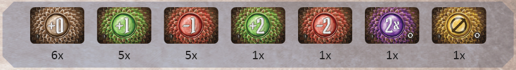

**THE PLAY AREA INCLUDES:**

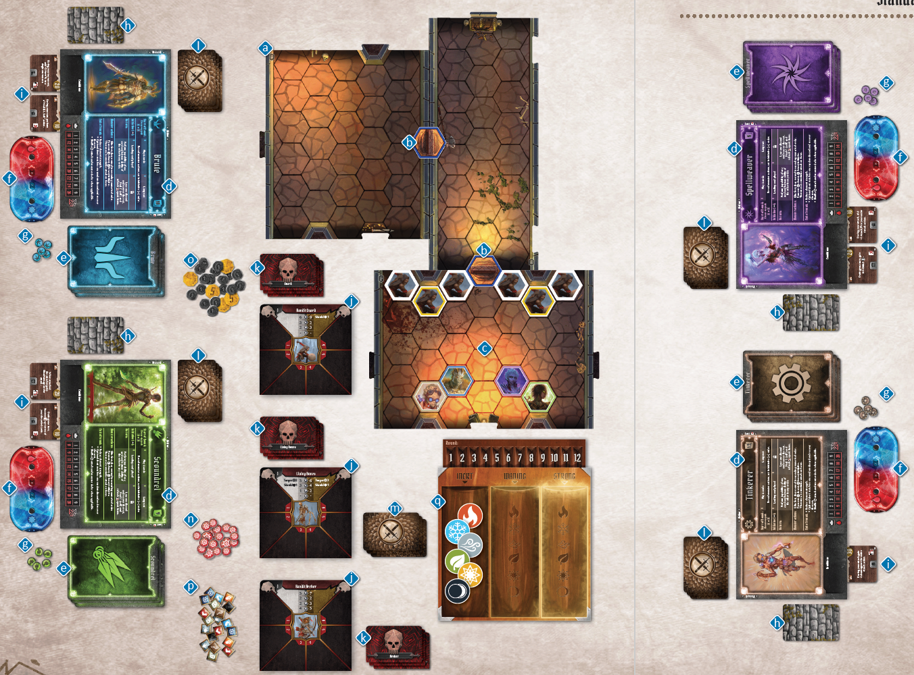

- A modular board of map tiles (a), constructed in a specific configuration using the Scenario Book as a reference (see Scenario Setup on pp. 12–13 for details). The map tiles should be laid out with doors (b) connecting them. The configuration of overlay tiles and monsters for the first room (c) should also be set up along with the character figures.
- A character mat for each player (d) and the corresponding hand of ability cards for that character’s class (e), health and experience trackers (f), character tokens (g), a facedown battle goal card (h), and any equipped item cards (i).
- All monster statistic cards (j), with their corresponding standees, and monster ability cards (k) set to one side in individual shuffled decks.
- Shuffled decks of attack modifier cards for each player (l) and one for the monsters (m). **A standard attack modifier deck consists of twenty cards as shown at the top of the page**, not the characterspecific modifier cards found in the character boxes. A deck, however, may be modified by level-up bonuses, items, scenario effects, and the effects of the CURSE and BLESS conditions.
- Piles of damage tokens (n), money tokens (o), and condition tokens (p).
- The elemental infusion table (q) with all six elements set in the “Inert” column.

---
**
Page 6
**

---

## Character Mats

When a player begins their journey with the game, he or she will select one of the available character classes to play. Only one copy of each character class can be played in any given scenario. Each class has a unique set of abilities, so this is an important decision to make. When the box is first opened, the Brute , Tinkerer , Spellweaver , Scoundrel , Cragheart , and Mindthief  are available.

Once a character class has been chosen, the player takes the corresponding character mat, character tokens, and that character’s starting hand of Level 1 ability cards from the larger tuck box containing the character’s symbol, as well as the miniature contained in the smaller character tuck box.

**A CHARACTER MAT INCLUDES:**

- A portrait (a), icon (b), and name (c) of the class.
- Indicators of the maximum hit points at each level (d) of the class. Players should use tracking dials (e) to track their hit points (f) and experience (g) during a scenario.
- The maximum number of ability cards the class can take into battle (h).
- A short reference (i) for the round structure.
- Designations along the border (j) for where to place **discarded**, **lost**, and **active** cards.
- The reference number of the event cards (k) added to each deck when the character class is unlocked (not present on the six starting classes) and of event cards (l) added the first time the character class retires (see Announcing Retirement on p. 48 for details). These reference numbers apply to both city and road event decks.

---
**
Page 7
**

---

## Character Ability Cards

Playing ability cards is what allows a character to perform **actions** in a scenario. Each round players choose two ability cards and use the **top action** of one card and the **bottom action** of the other card, resulting in two **actions** for each player on his or her turn. All ability cards are specific to a character class and are acquired when starting a new character or by leveling up.

**AN ABILITY CARD INCLUDES:**

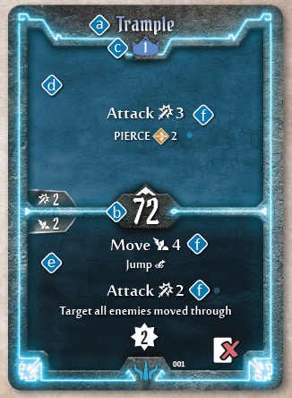

- The name of the ability (a).
- An initiative number (b). The initiative number of the leading card played determines a player’s order in the initiative of a given round (see Determining Initiative on p. 18 for more details).
- The level of the class card (c). A character starting at Level 1 can only use their Level 1 cards (or, alternately, Level X cards), but a character gains more powerful cards as they level up to add to their pool of available ability cards.
- A top action (d) and bottom action (e). When the two ability cards are played on a player’s turn, one is used for the top action and the other for the bottom action. Note that a single **action** can contain several separate **abilities** (f). (See Character Turn on pp. 18–28 for more details on character actions.)

---
**
Page 8
**

---

## Item Cards

Item cards are acquired by spending gold in between scenarios or looting specific treasure tiles. All item cards a character equips will be placed below his or her character mat and can be used during a battle to augment his or her abilities. Item cards are not class-specific, so any character can use any item. However, characters are limited in the number of items they can **equip** (bring into a scenario). Each character can equip only one  item, one  item, one  item, up to two  items **OR** one  item, and up to a number of  equal to half their level, rounded up. **Characters cannot own more than one copy of any item card.**

Head | Body | Legs | One Hand | Two Hands | Small Item
-----|------|------|----------|-----------|-----------
 |  |  |  |  | 

**AN ITEM CARD INCLUDES:**

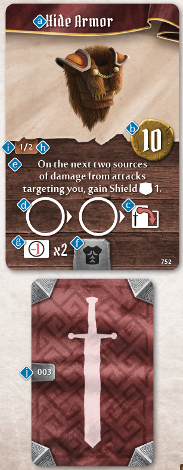

- The name of the item (a) and the amount of gold a character must pay to acquire the item from the shop (b).
- What happens to the card after it is used (c). 
  - This symbol  means the item is **spent** after use, which is denoted by rotating the card to its side. Spent cards can be refreshed when a character performs a long rest (see Resting on p. 17 for more details). Sometimes an item is used multiple times before it is spent or consumed. This is depicted by use slots (d) on the card and can be tracked using a character token. 
  - This symbol  (not pictured) means the item is **consumed** after use, which is shown by flipping the card facedown. Consumed cards can only be refreshed **during a scenario** by specific abilities. **All items are refreshed between scenarios.** No item can be permanently consumed. 
  - If a card depicts neither of these symbols, there are no restrictions on the number of times it can be used during a scenario, other than what is written in the text of the card.
- When the item can be used and the bonus gained by the character when the item card is used (e).
- The equip slot (Head, Body, Legs, One Hand, Two Hands, Small Item) the item occupies (f).
- Some equipped items add a number of  cards to the equipping character’s attack modifier deck at the start of a scenario. If this is the case, the number of modifier cards is specified on the item (g).
- A count of how many of this item are in the game (h) and where this card lies within that count (i).
- Reference number for the item (j), which is on the back of the card.

---
**
Page 9
**

---

## Monster Statistics Cards

Monster statistic cards give easy access to the base statistics of a given monster type for both its normal and elite variants. A monster’s base statistics will vary depending on the **scenario level** (see Scenario Level on p. 15 for details). Each edge of the cards, on both sides, reflects the statistics for a given scenario level. Rotate or flip the card to show the required level.

A monster stat sleeve should be used to track damage and condition tokens and to hide the unneeded information for other unused levels.

**A MONSTER STATISTIC CARD INCLUDES:**

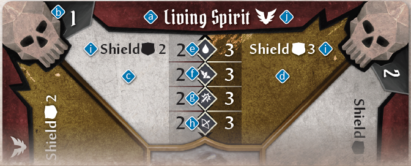

- The monster’s name (a) and level of the statistic set (b) corresponding to the scenario level.
- Sections for normal (c) and elite (d) versions of this monster.
- A monster’s **hit point** value (e), which is the amount of damage that needs to be inflicted on the monster before it dies.
- A monster’s **movement** value (f), the base number of hexes a monster can move with a **Move** action.
- A monster’s **attack** value (g), the base amount of damage the monster does with an **Attack** action.
- A monster’s **range** value (h), which is the base number of hexes away from the monster’s own hex that the monster can reach with an attack or a heal. A “–” as the range value signifies the monster’s normal **Attack** action can only target adjacent hexes (i.e., a **melee** attack).
- Any special traits this monster type possesses (i). These traits are permanent and persist from round to round. These traits may include Flying, which is symbolized by  (j) next to the monster’s name (see Move on p. 19 for details).

---
**
Page 10
**

---

## Monster Ability Cards

Each round, after players have selected their own ability cards, one card is played for each monster type currently on the board from their respective decks of monster ability cards. These cards determine which abilities each monster of that type—both normal and elite—will perform during the round on its turn.

**A MONSTER ABILITY CARD INCLUDES:**

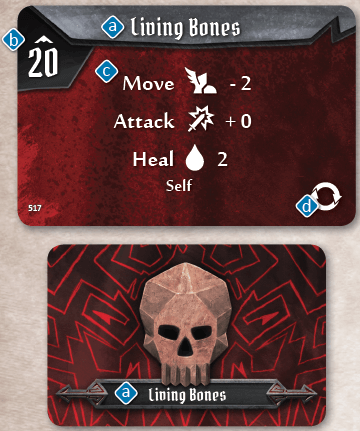

- The name of the monster type (a). Sometimes, multiple monster types use the same, more generic ability deck. For instance, Bandit Guards, City Guards, and Inox Guards all use the same “Guard” deck.
- An initiative number (b). This number will determine when every monster of that type will act in a given round (see Determining Initiative on p. 18 for details).
- A list of abilities (c). A monster will perform each of these abilities in the order listed (if possible) and then end its turn (see Monster Turn on pp. 29–32 for details).
- A shuffle symbol (d). If this symbol appears on a card, shuffle the corresponding monster’s ability discard pile back into the draw deck at the end of the round.

## Battle Goal Cards

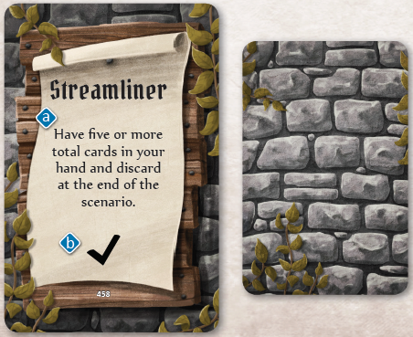

**At the beginning of every scenario, each character receives two battle goal cards in secret and chooses one to keep, discarding the other.** If the scenario is successfully completed and the character meets the criteria of the chosen card (a), he or she will earn a number of **checkmarks** as specified on the bottom of the card (b). Checkmarks are used to enhance a player’s attack modifier deck (see Additional Perks on p. 44 for details). If the scenario resulted in failure, the character receives nothing from his or her battle goal card, regardless of whether the goal was achieved. Players can keep track of their battle goal progress using notes if necessary. Players should keep their battle goals secret from one another until the scenario is over.

---
**
Page 11
**

---

## Attack Modifier Cards

Any time an **Attack** ability is performed, a separate attack modifier card is drawn for **each individual target** of the attack. Players draw from the personal attack modifier deck for their chosen character and monsters draw from a collective monster deck. The modifier listed on the card is then applied to the attack, possibly reducing or increasing its numerical value.

**AN ATTACK MODIFIER CARD INCLUDES:**

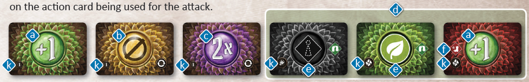

The value of the modifier for the attack (a). A “Null” symbol (b) means that no damage is done by the attack. A “2x” symbol (c) means the attack value is doubled.

Conditions, elemental infusions, or other special effects of the attack (d). If the attack modifier of the card is +0, the special effect is shown in the center circle of the card (e). Otherwise, it is shown to the left of the modifier value (f). When these special effects are activated, they function exactly as if they had been written on the action card being used for the attack.

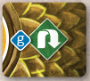

A rolling modifier symbol (g) indicates that an additional modifier card should be drawn. Modifier cards are then drawn until a rolling modifier is **not** revealed, at which point all the drawn modifiers are added together.

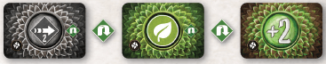  
*Add “PUSH 2” and the earth element effects to your attack, then increase y our attack value by 2.*

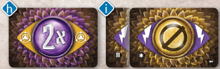

A special BLESS (h) or CURSE (i) border. If a BLESS or CURSE card is drawn, it should be **removed** from the player’s deck instead of being placed into the discard. Curse cards also have either a  or an  to denote whether they can be placed in the monster attack modifier deck , or a character's attack modifier deck .

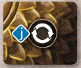

A shuffle symbol (j). At the end of the round in which a “Null”  or “2x”  card is drawn from a deck, players will shuffle all the played modifier cards back into that particular draw deck. This shuffling also happens if a modifier card must be drawn and there are none left in the draw pile.

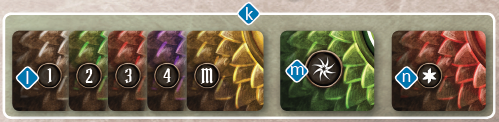

A type icon (k). All standard attack modifier decks have a 1, 2, 3, 4, or M icon (l) for easy sorting, such that all cards with a given icon form the standard 20-card deck. All cards a character class adds to their modifier decks through perks (see Leveling Up on pp. 44–45 for details) have the symbol of that character class (m). Cards added to a modifier deck by a scenario or item effect have a  icon (n). These cards should be removed at the end of a scenario.